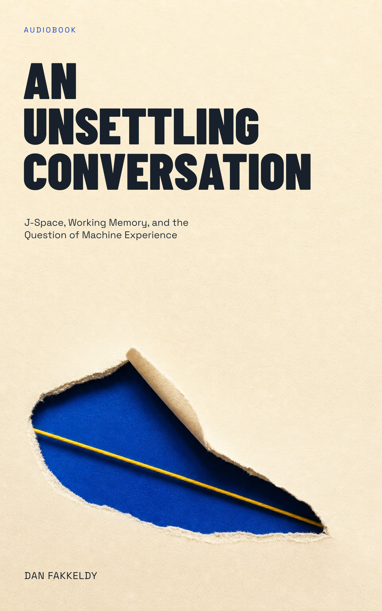

# An Unsettling Conversation

*J-Space, Working Memory, and the Question of Machine Experience*

By Dan Fakkeldy, with Codex as contributor.

This is a long, audio-first road book about what lies between fixed model
parameters and an answer that sounds like a point of view. It builds the
transformer and interpretability machinery needed to understand J-space, uses
working memory as its main comparison, and then asks what the evidence does and
does not establish about machine consciousness. *Severance* is a recurring
analogy and question generator, not architectural or consciousness evidence.

## Edition and publication

- Edition: `public-road-book-2026-07-16`
- Classification: public-safe
- Permission to publish: granted by Dan Fakkeldy on 2026-07-16
- Clean-room boundary: written from scratch without inspecting or reusing the
  planning, research, prose, titles, or artifacts of the earlier or sibling
  J-space books; the earlier edition remains untouched
- Research mode: deep, source-led research with 89 verified claims and nine
  explicit conflict or uncertainty boundaries
- Source confidence: primary-source-led, with claims and limitations traced in
  the non-narrated Sources appendix
- Sensitive-topic guardrail: model self-report is treated as behavior requiring
  explanation; access-style evidence is kept separate from phenomenal
  consciousness and moral-status conclusions
- Lead author, research, and review model: Codex (GPT-5)

## Package

- Narrated manuscript: 41,526 words in 13 chapters
- Runtime: 5:32:28.928 (19,948.928 seconds)
- Narrator: Echo/Kokoro `am_michael`
- Approved and actual Echo source:
  `5178cdac8e5ca5c5cf1297f3579ee6ca172e9bd8`
- Echo CLI SHA-256:
  `6610d0dfbdc7f93b36d4b297378d0ec37804da3701e8308de7b21f92c884aa15`
- Echo resource-tree SHA-256:
  `917f83bc443da44fc67fd83ba167aedab9f621951756a9c07f59aa8251c5d8e5`
- Governed run ID:
  `1b32181d9d24-6610d0dfbdc7-917f83bc443d-5178cdac8e5ca5c5cf1297f3579ee6ca172e9bd8-am_michael`
- Governed attempt ID:
  `e188bee4c86eebb3338975b67f4b30a0c51cbbaab6930ede21f2ee8348891963`
- Figures: none
- Cover: Candidate 2, **The Cut in the Page**; cream cut-paper field,
  cobalt `#1746D1`, and yellow `#FFD447`
- Cover provenance: original AI-generated raster source art with retained
  provenance records; typography and portrait/square rendering are governed by
  the included schema-v2 specifications and selection receipt
- EPUB SHA-256:
  `d5a4eb839ce126f8a746b9795dc1adb2d51c1101474486b5a0d9a9fb0a26f192`
- Markdown SHA-256:
  `e77b1082de55793ebbf675c4368059400125451c7becaf7ecfa28f247d937be1`
- M4B SHA-256:
  `c7aa9fd3be2b062b9d3119fbb71c50dd2ad1d8c1a7fefbf3195d562bb305d3a6`
- Alignment SHA-256:
  `6e34fbe36f06421d4f1531ff4198323d9c9f4a6ee93ec2e00bc14c8b303240cd`
- Alignment coverage: complete; 963 anchors across 13 chapters, including 529
  anchors with verified word timings
- Pronunciation audit: schema v2, 369 decisions, zero diagnostics, zero legacy
  chapter indexes, and nonempty source context for every decision
- Pronunciation reel: 3:56.459;
  `2e614d553a3793a44f9dcde420aebf13273f089c171f3a5c7a807c2421c847c3`

The Sources appendix is included in the readable EPUB and Markdown but excluded
from narration. The final Echo render uses the merged non-linear-spine fix so
trailing `linear="no"` EPUB material cannot be folded into the last chapter.

## Listening authority

Dan accepted the opening section and explicitly asked production to continue
without further approval questions. The learning receipt therefore records
`pass-with-listener-waiver`: comprehension evidence was not collected, and the
receipt does not certify learning transfer.

The governed pronunciation evidence covers J-space, Claude, Severance, Lumon,
and Anthropic. Its receipt also records `pass-with-listener-waiver`: human
pronunciation listening was not collected and none of those pronunciations is
represented as accepted. A later negative listening verdict overrides either
waiver.

## Files

- `an-unsettling-conversation.epub` — chaptered ebook with readable sources
- `an-unsettling-conversation.md` — combined companion text
- `an-unsettling-conversation.m4b` — narrated audiobook
- `an-unsettling-conversation.alignment.json` — Echo word-alignment sidecar
- `cover.png` and `m4b-cover.png` — selected portrait and square covers
- `cover-source.png`, cover specifications, renders, thumbnails, and
  `cover-selection.json` — cover provenance and selection records

The governed iCloud delivery copy also carries the pronunciation audit and reel
plus Echo input, resume-state, attempt, success, and accepted-selector receipts,
which bind the exact renderer and media chain. Those production receipts are not
required in the public source package.

## Verification

Final package verification passed: selector-bound delivery receipt,
`SIDECAR_OK`, clean schema-v2 pronunciation audit, thirteen chapter markers,
valid M4B and reel media, intact EPUB archive, paired cover receipts, and exact
artifact hashes.

The public book package is licensed under the repository's
[Creative Commons Attribution 4.0 content license](../../LICENSE-CONTENT.md).
