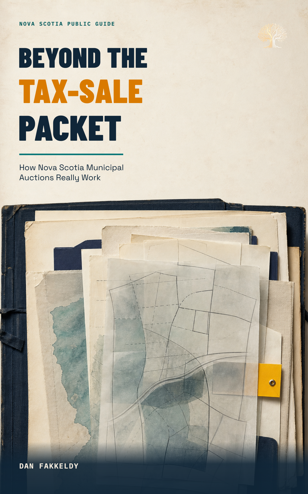

# Beyond the Tax-Sale Packet

*How Nova Scotia Municipal Auctions Really Work*

By Dan Fakkeldy. Written, researched, reviewed and produced with OpenAI Codex
(GPT-5), using official Nova Scotia and municipal sources.

This public text-and-audio edition explains Nova Scotia municipal tax sales as a
source-disciplined research process. It follows **notice → parcel → context →
unknowns → handoff**, separating what a municipal notice, public map or dated
record establishes from questions that still belong to the municipality, a
lawyer, surveyor, planner, inspector, insurer, accountant or bidder.

## Edition and publication

- Edition: `governed-final-54-figure-2026-07-23`
- Publication status: `governed-final`
- Classification: public-safe
- Permission to publish the audiobook: granted by Dan Fakkeldy on 2026-07-23
- Exact manuscript text: reviewed and approved by Dan Fakkeldy
- Chapter 5 mineral-occurrence revision: requested and approved by Dan Fakkeldy
- Cover: **The Packet Lifts**, selected by Dan as Candidate 1
- Chapters: 13
- Narrated words: 32,983
- Interior figures: 54
- Audiobook: 4:12:50 chaptered `am_michael` edition included
- Full-book human listening: accepted by Dan Fakkeldy
- Video edition: not included

The revised illustrated edition has passed manuscript-hash, learning-design,
prose, cover-pair, archive-integrity, embedded-cover, alignment, full-decode and
acoustic checks. Its governed `am_michael` audiobook narrates the same current
54-figure EPUB text and includes the approved Chapter 5 mineral-occurrence
revision.

This edition has passed package and audio checks. The creator completed the full listening review and approved this edition for publication.

The complete listening verdict accepted the rendered Touquoy passage in
context. It does not establish a canonical pronunciation for the name; Dan
explicitly said he did not know how Touquoy should be pronounced.

## Reader artifact hashes

- Markdown SHA-256:
  `6a636ec20a11d54dbf1d84e354bb8d2df178637e7a8e34bf0883662481efb670`
- EPUB SHA-256:
  `b2399f3850e98050fe58e913ba1bd8cfd1cc5a86331b4b3a4f884959f82d666d`
- M4B SHA-256:
  `f56220fea72c767a225a1538ad70c0e160763830bd15bb9bc2cb9f0fe474c505`
- Alignment SHA-256:
  `c5c8b5ed7fd8fc2f1595edadb292d9356be51790f758656bffeaad0352665dcc`
- Portrait cover SHA-256:
  `fffaf3037b43f6341a822cb004a0a4d1829e8ef56df80c753400471ffe53ddf6`
- Square companion cover SHA-256:
  `350a78085825b8cadcf706d0be7355cc7020030b5cf86b90a5376aea3eeb707c`
- Paired cover-selection receipt SHA-256:
  `799e33994aa4b338bbcc1b5ceb916defd96ecf2f4fe5aa15ffdf6a96502f1b32`

## Verification boundary

The EPUB embeds the selected portrait cover byte-for-byte. The M4B embeds the
selected square companion with normalized-pixel identity. The M4B and alignment
match the current narrated EPUB text. The `governed-final` status records the
completed human listen and publication authorization; it does not convert map
screening evidence into proof of access, title, condition, value, permission or
buildability.

The material is educational only. It is not legal, tax, investment, title,
surveying, appraisal, access, environmental, insurance, planning, tenancy or
construction advice. Municipal lists and procedures change. Always verify the
current municipal notice, statute and event terms, and use qualified
professionals for a live property decision.

## Files

- `beyond-the-tax-sale-packet.epub` — chaptered public ebook
- `beyond-the-tax-sale-packet.m4b` — governed chaptered audiobook
- `beyond-the-tax-sale-packet.alignment.json` — portable Listening Room sidecar
- `beyond-the-tax-sale-packet.md` — companion manuscript
- `images/` — 54 public-safe teaching and map-workflow figures
- `cover.png` — selected EPUB portrait cover
- `m4b-cover.png` — selected square audiobook cover
- cover specifications, receipts, thumbnails and `cover-selection.json` —
  reproducible cover provenance and publication permission
- `publication.json` — machine-readable public-first-listen receipt

Audiobook candidate hashes, the reuse decision and the human checklist are
recorded in the public-safe development packet under
`docs/nova-scotia-tax-sale-book/`; resumable renderer and pronunciation-review
artifacts remain outside this public book directory.

This public book package is licensed under the repository's
[Creative Commons Attribution 4.0 content license](../../LICENSE-CONTENT.md).
