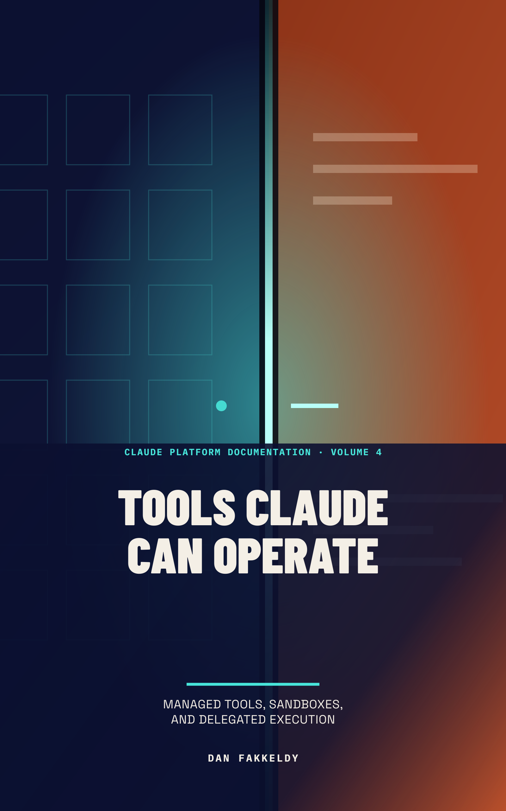

# Tools Claude Can Operate

*Managed Tools, Sandboxes, and Delegated Execution*

By Dan Fakkeldy. Written and produced with Claude Opus 5, using the official
Claude Platform documentation as the primary source.

This is Volume 4 of the Claude Platform Documentation audiobook series. It is a
mechanism-first road book about every tool Anthropic provides: the
server-executed ones it runs for you — web search, web fetch, code execution, the
advisor tool, tool search — and the Anthropic-schema client tools your own
application still executes, which are memory, Bash, text editing, and computer
use. It also covers the shared server-tool mechanics, turns that mix both kinds
of tool, tool-context economics, programmatic tool calling, and fine-grained tool
streaming.

Volume 3 covered client-defined tools and the application-owned agent loop. The
information architecture around a long-running application — caching, compaction,
context editing, Files, Skills, and MCP — belongs to Volume 5.

## Edition and publication

- Edition: `public-first-listen-2026-07-25`
- Claude Platform documentation verified: 2026-07-25
- Classification: public-safe
- Permission to publish: granted by Dan Fakkeldy on 2026-07-25
- Publication status: `public-first-listen`
- Human listening status: pending
- Author: Dan Fakkeldy
- AI writing, research, review, and production contributor: Claude Opus 5

This edition has passed package and audio checks. The creator's full listening review is still underway.

The lightweight listener contract is simple: reply `continue` if the book is
working as a road-listening lesson, or `revise` with the passage or concept that
needs repair. A later `revise` verdict supersedes this first-listen edition.

## Package

- Narrator: Echo/Kokoro `am_michael`
- Chapters: 15
- Runtime: 3:56:45.696 (14205.696000 seconds)
- Manuscript: approximately 35,152 narrated words
- Figures: none
- Cover: **Two Rooms, One Door**, selected as the paired portrait and square art
- Alignment: 699 read-along anchors

### Reader artifact hashes

- Markdown SHA-256:
  `caeca5bfb2151fa8441370cad7297a8fa8560257b8111b426b90205033065daa`
- EPUB SHA-256:
  `570d3b1ab8db8a8defe9eefa6561be3f1da187f5462c0f73ad4d111a33af6570`
- M4B SHA-256:
  `92293d3c52607681a07afbe7b5cedb83da16e6587536d4090f5fe52dceb40f9a`
- Alignment SHA-256:
  `827db6b8aabe12b2be8979936e56e5d1a6d0de04d821188bd26509f1025c719d`
- Portrait cover SHA-256:
  `ac2d07097c520ce05780888fd4f7212634552e92a78b39f13262e500297987ea`
- Square cover SHA-256:
  `e7fe63749d9ccde1ef5fe17a53e4ef13b1aab039c615753d5e4a4b49b15ad715`

## Cover provenance

The selected portrait and square covers, their schema-v2 specifications, render
receipts, thumbnails, original source raster, and the publication-authorized
paired selection receipt are all preserved here. The receipt identifies **Two
Rooms, One Door** as the delegated editorial choice and records the public-safe
classification and permission to publish. The cover art is original vector work
authored for this volume; no third-party or generated imagery is included.

## Verification

The package passed EPUB archive integrity and an uncompressed-`mimetype` check,
M4B duration and 15-chapter probes, read-along sidecar verification,
schema-2 pronunciation audit checks, paired-cover identity verification across
the selection receipt and both embedded covers, exact artifact hashing, public
path checks, and private-material scanning.

The manuscript carries two independent hash-bound receipts that bind the same
canonical chapter hashes: a learning-design receipt recording the schema-v2
process, and a prose-style receipt recording the de-Claudification gate with all
six rhetorical families at zero. Neither receipt certifies that learning
occurred; human comprehension listening remains pending and a negative verdict
supersedes them.

The Sources and Drift Notes appendix is available to readers and intentionally
excluded from the narration spine and the narrated word count. Every price,
version string, beta header, and platform-availability claim in this volume is a
dated 2026-07-25 snapshot.

Internal production records, pronunciation-review media, and research snapshots
are deliberately excluded from this public reader package.

## Files

- `claude-platform-04-tools-claude-can-operate.epub` — chaptered ebook
- `claude-platform-04-tools-claude-can-operate.md` — companion manuscript
- `claude-platform-04-tools-claude-can-operate.m4b` — chaptered audiobook
- `claude-platform-04-tools-claude-can-operate.alignment.json` — Echo read-along sidecar
- `cover.png` and `m4b-cover.png` — selected portrait and square covers
- `source-art.png` — original selected cover source raster
- `sources.md` — reader-facing sources and drift notes
- cover specifications, render receipts, thumbnails, and `cover-selection.json`
  — public cover provenance and publication permission
- `publication.json` — machine-verifiable public-first-listen receipt

This public book package is licensed under the repository's
[Creative Commons Attribution 4.0 content license](../../LICENSE-CONTENT.md).
