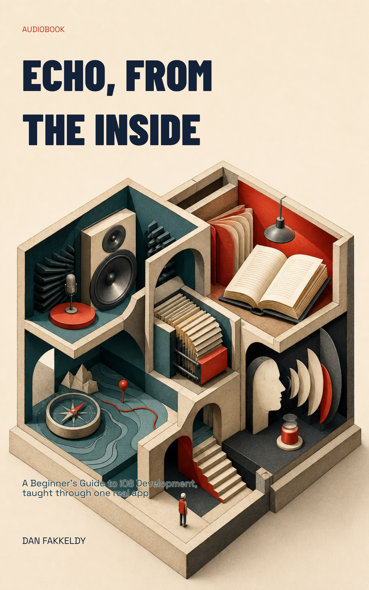

# Echo, From the Inside
_A Beginner's Guide to iOS Development, taught through one real app_

The July 2026 paired-cover release uses **Rooms Inside the App**. `cover.png`
is the portrait EPUB and library cover; `m4b-cover.png` is the independently
composed square audiobook artwork. `cover-selection.json` binds both variants
to one approved source and public EPUB edition. The previous portrait is
preserved as `cover-pre-paired.png`.

> You built something real with AI and grit, and it works — but you can't quite explain why. This book is the bridge from grit to understanding.

This is a guided tour of how a real iOS app gets built, using the genuine internals of **Echo** — an open-source, on-device audiobook study player — as the worked example. No toy weather app, no pretend to-do list: just the actual parts of an app that actually ships, taken apart gently, one piece at a time. And it's written for the ear, so you'll hear no code — not one line. When we point at a real part of Echo, we name it in plain English and explain the idea behind it, including the part most tutorials skip: *what each choice quietly traded away.*

## What you'll learn

Starting from the very first question — what an iOS app actually *is* — you'll work outward through the whole machine:

- **The foundations:** the sandbox and the four targets, why Apple made Swift, and how SwiftUI describes a screen.
- **State and structure:** the Observable revolution, and the hard-won lesson of taming a two-thousand-nine-hundred-line "god class."
- **Where data lives:** the database, and the quiet terror of migrations — changing the floor while you're standing on it.
- **The interesting, hard stuff:** making sound behave, turning a zip of web pages into clean text, the alignment problem, and generating a voice entirely on-device.
- **The craft underneath:** one shared brain across many bodies, learning science encoded in software, accessibility as architecture, doing many things at once safely, and what it really means to ship and live with your code.

Every chapter carries the same promise: not just *what* a part does, but *why* it's shaped that way and what it cost.

## Who it's for

Anyone who built something real with AI and willpower and now wants to genuinely understand it — not to pass an interview, but to stand inside their own creation and know every room.

## Listen & read

[**EPUB**](echo-from-the-inside.epub) · [**Markdown**](echo-from-the-inside.md) — 17 chapters, about 5.4 hours of listening at 1.25x speed.

## Narrated package

The public reading edition is `echo-from-the-inside.epub`; the chaptered audio
is `echo-from-the-inside.m4b`; and `echo-from-the-inside.alignment.json`
provides 547 verified read-along anchors. The EPUB embeds the portrait
`cover.png`, while the M4B embeds the square `m4b-cover.png`. The package is
ready for browser playback and synchronized reading through KinNoKi Labs after
the public-media gate.

---

Written by Opus 4.8 (an AI model), grounded in Echo's real source and docs — spot-checked, not expert-reviewed. See the collection's [honest disclosure](../../README.md#honest-disclosure).
