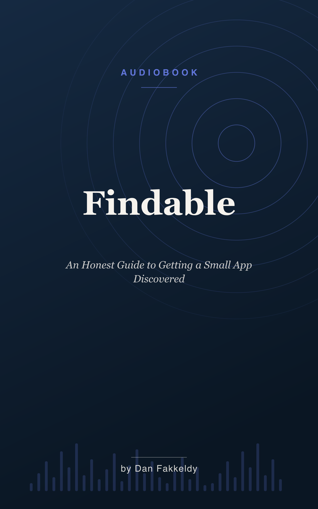

# Findable
_An Honest Guide to Getting a Small App Discovered_

> Picture a bookshelf the size of a city, two million spines pressed shoulder to shoulder, and you standing somewhere in the middle holding the one thing you made. That shelf is the App Store. Nobody is searching for your app by name. They can't — they've never heard it. This book is about how the right few thousand people find it anyway.

**Findable** is a beginner's audiobook about App Store Optimization for a small, indie app with no marketing budget and no crowd yet. It teaches the craft the honest way — as matchmaking, not trickery — and grounds every lesson in the real store data of a real one-person launch, while staying generic enough to apply to *your* app, whatever you built. It's written for the ear: no jargon dumped on you, every term explained in plain language as it arrives, every idea carried by a picture you can actually hold in your head.

The thread running through it is a hopeful one: you can't out-shout the giants, but you can out-specific them. Own the exact words your exact person types, and let those words carry strangers to your door.

## What you'll learn
- Why "build it and they will come" is a quiet lie, and how search really works — being **found** versus being **chosen**
- How your **title and subtitle** do two jobs at once, for the machine and for the human
- The hidden **keyword field** nobody sees, and how to spend it
- Reading **keyword-difficulty** numbers and finding words with a real crowd around them
- Winning the **three-second decision** on your product page
- Sizing up your **real competitors** honestly
- The **cold-start problem** — launching with zero ratings — and the **long game** that compounds

## Who it's for
Indie developers and solo builders with a small, good app, no marketing budget, and a name nobody is searching for yet — which is to say, almost everyone at the start.

## Listen & read
8 chapters, about 3 hours at 1.25x speed (~33,500 words). Read along or load it into your player:
- **EPUB:** [findable.epub](findable.epub)
- **Markdown:** [findable.md](findable.md)

---

*Written by Opus 4.8 (an AI model), grounded in real App Store data from a real launch. Spot-checked, not expert-reviewed — please read the collection's [honest disclosure](../../README.md#honest-disclosure) before treating any of it as gospel.*
