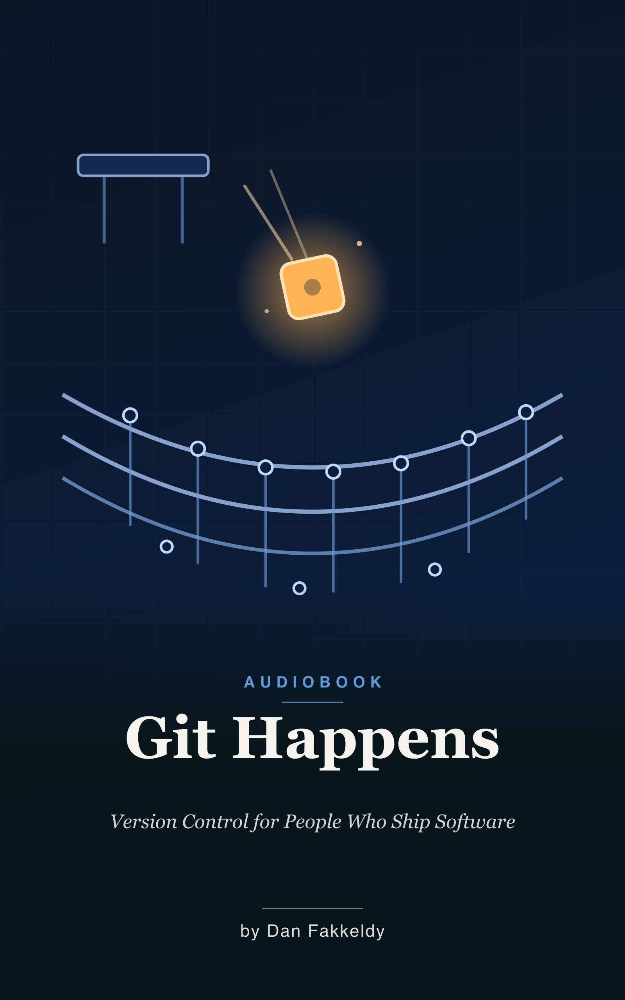

# Git Happens: Version Control for People Who Ship Software
_A narrated guide to Git and GitHub, taught through the Echo codebase_

> You did not learn Git. You learned Git-adjacent. You learned the incantations without understanding the spell. This book is about the spell.

This is a beginner's audiobook about version control, taught entirely through one real, shipping app. Echo is an open-source audiobook player for iPhone, Apple Watch, and Mac — over a thousand commits, eighty-one merged pull requests, two dozen database migrations, a license that changed from MIT to GPL in a single clean commit, and a real promotion-ladder release workflow (`nightly → weekly → main`). Every concept here is grounded in a moment that actually happened in that project's life. It is written for the ear, not the screen: no code read aloud, no railroad-track syntax diagrams, just the *why* behind the commands so the *how* becomes muscle memory.

## What you'll learn

You'll start in the save-as graveyard — those folders full of "final," "really final," and "final for real this time" — and walk out the far side fluent. Along the way:

- Why version control exists, and what a repository actually is under the hood
- Commits that tell stories instead of saying "fixed stuff," and the Conventional Commits habit that makes history searchable
- Branching and merging — safe spaces to experiment, and the merge moment when they come back together
- GitHub, pull requests done well (and aimed at the right branch), and how to review code (and people) with insight and kindness
- The CI robot in the pipeline that gates every branch before a change lands
- The promotion ladder — how a feature climbs `nightly → weekly → main` to TestFlight and the App Store, the way a senior team ships, run solo
- Undoing mistakes calmly, time-traveling through history, shipping releases, and going open source from day one

The spine of the whole thing is four ideas: every commit tells a story, solo doesn't mean sloppy, Git is the safety net that lets you be braver, and you can ship like a senior team — changes climb a ladder, and nothing reaches users until it earns the next rung.

## Who it's for

Anyone building software in the margins of their life who has copied a few Git commands but never felt in control of them — and wants to.

## Listen & read

Sixteen chapters, about 4.6 hours at 1.25x. Listen via the [EPUB](git-happens.epub), or read the [Markdown](git-happens.md).

---

Written by Opus 4.8, grounded in Echo's real source and history — spot-checked, not expert-reviewed. See the collection's [honest disclosure](../../README.md#honest-disclosure).
