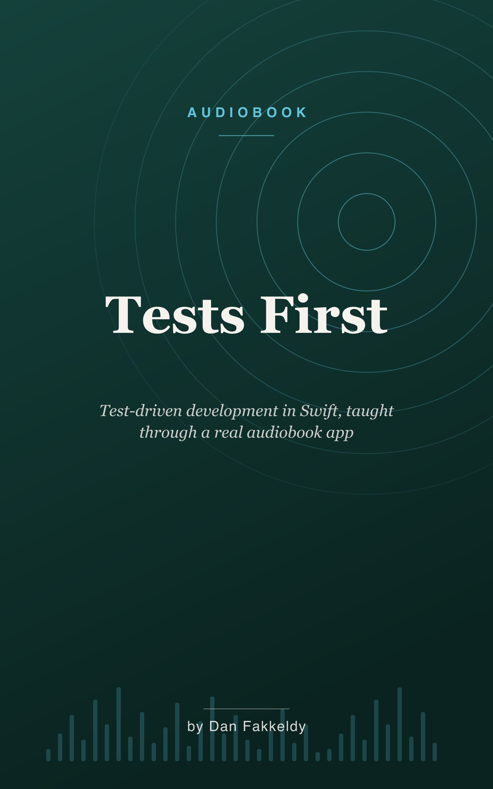

# Tests First: Test-Driven Development for People Who Are Scared to Change Their Code
_A narrated guide to testing and TDD in Swift, taught through the Echo codebase_

> You change one small shared thing and you have no idea whether the Watch, the Widget, or the Mac app just quietly broke while the iPhone still looks fine. That cold feeling in your stomach is not a discipline problem. It is a memory problem. This book is the cure.

This is a beginner's audiobook about automated testing and test-driven development, taught entirely through one real, shipping app. Echo is an open-source audiobook study player for iPhone, Apple Watch, and Mac — one shared core feeding four faces, guarded by a suite of 116 test files, 586 individual tests, and 1,369 checks that all run from a single command. Every concept here is grounded in a test that actually exists in that project. It is written for the ear, not the screen: no code read aloud, no syntax, just the *why* behind each practice so the *how* becomes instinct. It assumes you have never written a test in your life.

## What you'll learn

You'll start in that late-night moment of dread — the edit you're afraid to make — and walk out the far side able to change your own software without fear. Along the way:

- What a test actually is: a small, honest example with a known answer, and why that's all it ever needs to be
- The red-green-refactor loop — writing the failing example *first*, and why that feels backwards until it doesn't
- The modern Swift Testing tools Echo uses, and the honest reasons to pick them over the older framework
- Edge cases and table-driven tests — hunting the ugly inputs (including the value that isn't a number) where bugs actually hide
- Determinism: freezing the clock so a flaky test can't train you to ignore the colour red — and fast-forwarding through weeks of study in a microsecond
- Sandboxes: testing code that touches a real database without ever touching the user's data, and the dependency-injection habit that makes it possible
- Test doubles: faking a slow on-device neural voice so the unhappy paths become testable, and why the fake is the only honest reason to add an abstraction
- Regression tests: how a real book called *The High-Conflict Couple* broke Echo's chapter alignment, and how that bug became a permanent test — plus the harder discipline of knowing where to *stop*

The spine of the whole thing is three ideas: a test is just a small honest example with a known answer; determinism is the whole game; and testable means well-designed — the pressure to make code testable is the same pressure that makes it clean.

## Who it's for

Anyone building software in the margins of their life who has never written an automated test, and is quietly afraid of their own codebase — and wants to stop being.

## Listen & read

Nine chapters, about 2.5 hours at 1.25x. Listen via the [EPUB](tests-first.epub), or read the [Markdown](tests-first.md).

## Narrated package

The public reading edition is `tests-first.epub`; the chaptered audio is
`tests-first.m4b`; and `tests-first.alignment.json` provides 223 verified
read-along anchors. The EPUB embeds the portrait `cover.png`, while the M4B
embeds the square `m4b-cover.png`. The package is ready for browser playback
and synchronized reading through KinNoKi Labs after the public-media gate.

---

Written by Opus 4.8, grounded in Echo's real source and test suite — spot-checked, not expert-reviewed. See the collection's [honest disclosure](../../README.md#honest-disclosure).
