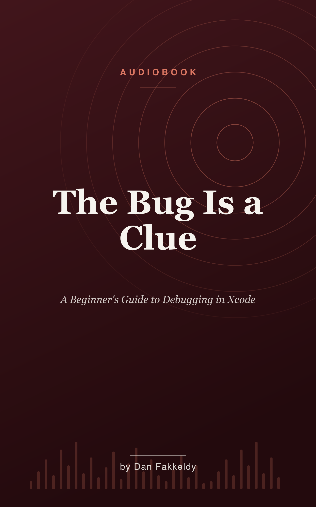

# The Bug Is a Clue
_A Beginner's Guide to Debugging in Xcode_

> A bug is not the machine disobeying you. It is the machine obeying you perfectly, and showing you that what you said wasn't quite what you meant. That gap is the most useful information you'll ever get — a clue, never a verdict.

This is a narrated, beginner's guide to debugging real iOS apps in Xcode — and it teaches the craft the only honest way: through bugs that actually happened. Every tool you'll learn is paired with a true story from Echo, a real open-source audiobook study app built by one solo developer learning as they went. No tidy toy problems engineered to break in one obvious way. These bugs are weird, specific, and stubborn, because the world made them, not a tutorial author. It's written entirely for the ear — no code or symbols read aloud, just plain-English detective work you can follow on a walk or a commute.

The whole book rests on one shift: from the dread of a crash to the curiosity of a clue. Debugging isn't the punishment for writing software. It is the job.

## What you'll learn
The scientific method of debugging — reproduce, isolate, hypothesize, test, verify — and then the windows that make an invisible program visible: reading the console and logging, breakpoints that pause reality, inspecting frozen variables and the call stack, holding a conversation with a paused program in LLDB, and breakpoints that think for you. From there into the hard cases: the anatomy of a crash, crash logs and symbolication, the infamous crash that wasn't your fault, chasing memory leaks, making corruption loud with the sanitizers, the slipperiest bugs of all in concurrency and data races, profiling instead of guessing, memory under the microscope, debugging the interface — and finally, the debugger's discipline that ties it all together.

Threaded through it are three real Echo war stories: a crash that left no trace of the app's own code, a memory leak that grew all day from a single switch, and a "successful" import that produced a book with no chapters at all.

## Who it's for
Beginners and self-taught developers who can write a bit of code but freeze when something breaks — and anyone who wants to trade panicked flailing for calm procedure.

## Listen & read
17 chapters, about 5.9 hours at 1.25x speed. Read it as an [EPUB](the-bug-is-a-clue.epub) or in [Markdown](the-bug-is-a-clue.md).

---

_Written by Opus 4.8, grounded in Echo's real debugging history. Spot-checked, not expert-reviewed — see the [honest disclosure](../../README.md#honest-disclosure)._
