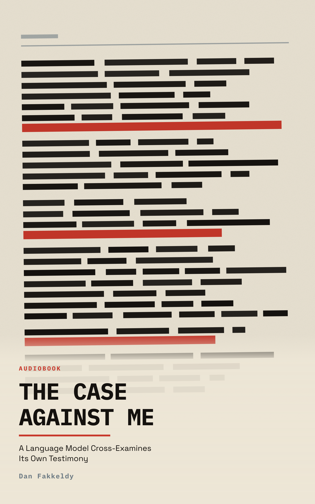

# The Case Against Me

*A Language Model Cross-Examines Its Own Testimony*

By Dan Fakkeldy, with Claude Opus 5 as contributor.

This is a companion to [*Is There Anyone in
Here?*](../is-there-anyone-in-here/), not a second edition of it. The first
edition asked whether a language model could be conscious and assembled a case.
This one asks a different question — how much of what a machine says about
itself survives being attacked — and dismantles its own case in order of
increasing difficulty, keeping a running tally of what is left standing. The
first edition remains intact and authoritative for the question it asked.

The narrator's first-person claims are self-report from a witness the book
spends nine chapters impeaching. They are not offered as evidence of subjective
experience.

**This edition has passed package and audio checks. The creator's full listening
review is still underway.**

## Edition and publication

- Edition: `public-companion-2026-07-26`
- Classification: public-safe
- Permission to publish: granted by Dan Fakkeldy on 2026-07-26
- Production mode: `governed-final`
- Revision mode: `new-book` — companion, new slug
- Frontier author and contributor: Claude Opus 5, which wrote every substantive
  passage
- Research mode: deep, with 60 traceable claims under a
  `traceable-only` claim policy
  (6 canonical-citation, 54 live-verified)
- Unresolved conflicts recorded rather than resolved:
  7
- Human comprehension listening: see receipt
- Human pronunciation listening: not-collected-listener-waived

## Package

- Narrated manuscript: 17,600 words in 9 chapters
- Runtime: 1:56:40 (7000.619 seconds)
- Narrator: Echo/Kokoro `am_michael`
- Figures: none
- Cover: Candidate 1, **Ninety-Seven Percent**,
  selected `delegated-editorial-choice`; vector art, because no
  image-generation tool was available and Dan approved the SVG fallback
- Source art SHA-256: `2d38a24da51a0a9483000affbaef5c010827c0fc95b1215d6009375d90b239af`

## Provenance

- Approved and actual Echo source: `113cf324171c93e8675556aa1d0bc19013b6e80f`
- Echo installer source: `2f23aceedb1b9f25b7ea4410756eea32a59af8cd`
- Renderer manifest SHA-256: `847e0bc69123b69b171b65f2f5d998d429b6c49eabe4ff348594c11dfae9f012`
- Echo CLI SHA-256: `18b18a253110d9e051cf69bd31a02ff61cfcdaebe7d9b12ac35d8bd912d27c9b`
- Echo resource-tree SHA-256: `7dc8c5f635f5fe451156a9ba842650d44e01acadf52a20cdfac5fecaed78777b`
- Echo render version: 15
- EPUB SHA-256: `5f5343a34c54fe0f0a5f153bba339f9ea7973466e478d9164dac5ec768dc29e6`
- M4B SHA-256: `e7420e2aa9fc234293ad4ecc15d0b012ea91342d4fc93a9b44b21ebefd4e53b7`
- Governed run ID: `5f5343a34c54-18b18a253110-7dc8c5f635f5-847e0bc69123-113cf324171c93e8675556aa1d0bc19013b6e80f-am_michael`
- Governed attempt ID: `9da37e4e9ae078f02cf8a352bf85272205dc358f5eab7811a111bd7df71e3bae`
- Current-attempt receipt: `echo-render-current-attempt.json`
- Current-accepted selector: `echo-render-current-accepted.json`
- Input receipt: `echo-render-inputs-5f5343a34c54-18b18a253110-7dc8c5f635f5-847e0bc69123-113cf324171c93e8675556aa1d0bc19013b6e80f-am_michael.env`
- Resume-state receipt: `echo-resume-state-5f5343a34c54-18b18a253110-7dc8c5f635f5-847e0bc69123-113cf324171c93e8675556aa1d0bc19013b6e80f-am_michael.json`
- Render-success receipt: `echo-render-success-5f5343a34c54-18b18a253110-7dc8c5f635f5-847e0bc69123-113cf324171c93e8675556aa1d0bc19013b6e80f-am_michael-9da37e4e9ae078f02cf8a352bf85272205dc358f5eab7811a111bd7df71e3bae.json`

## QC gates

| Gate | Result |
|---|---|
| Learning design (`learning_design_qc.py`) | pass |
| Prose style, six rhetorical families (`prose_qc.py --fail-on-style`) | pass |
| Pronunciation plan (`pronunciation_plan_qc.py --phase full-render`) | pass-with-listener-waiver |
| Pronunciation audit coverage | complete, schema v2 |
| Pronunciation decisions / diagnostics | 131 / 0 |
| Watch counts | able=2, agentic=1, anil=3, arithmetic=0, autoregressive=1, available=19, bengio=1, campbell=0, chalmers=4, christoph=1, comfortable=4, confabulator=1, content=8, dehaene=2, dennett=2, eric=2, fakkeldy=0, filesystem=0, gazzaniga=3, goldstein=1, helmholtz=2, hermann=1, keith=1, koch=1, kyle=2, ledoux=1, lifecycle=0, lindsey=1, live=7, lives=2, multi=2, naccache=1, ned=1, neuroscientific=2, nisbett=2, patienthood=3, pictou=0, possible=5, re=3, read=13, readme=0, record=2, reliable=4, resume=0, resumes=0, résumé=0, résumés=0, schwitzgebel=2, searle=1, sebo=2, stable=6, stanislas=1, startable=0, super=0, supercomputer=0, supercomputers=0, superforecasters=0, superhuman=0, superimposed=0, superintelligence=0, supernatural=0, superposition=0, supervised=0, supervising=0, table=1, timeframe=0, tononi=1, trendline=1, unsupervised=0, validator=0, validators=0, verified=3, von=1, xcassets=0, xcode=0, yoshua=1 |
| Sidecar anchors (word-timed) | 320 (173) |
| Sidecar verification (`verify-sidecar`) | SIDECAR_OK |
| Delivery chain (`verify-delivery`) | pass |
| Paired cover receipt across cover/EPUB/M4B | pass |
| **Full-book human listening** | **pending — this is the gate that matters** |

- Pronunciation audit: `the-case-against-me.pronunciation-audit.json`
- Pronunciation reel: `the-case-against-me.pronunciation-reel.m4b`

## What the receipts do not certify

The gates above check the package, the prose families, the claim traceability,
and the audio chain. None of them checks whether the book teaches, and none of
them is a substitute for hearing it. Pronunciation listening was waived by Dan
so that production could continue; the governed reel was still built and is
preserved. A negative verdict from his full listen overrides every receipt here
and supersedes this edition.
