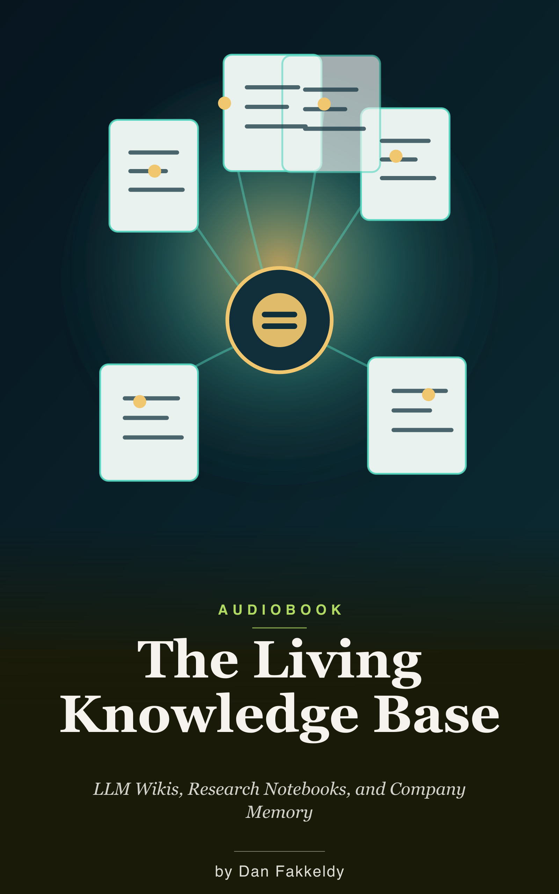

# The Living Knowledge Base
_LLM Wikis, Research Notebooks, and Company Memory_

> A practical, public-safe learning audiobook about turning scattered sources into maintained memory: raw evidence preserved, durable synthesis written down, and clear rules telling an agent how to keep the whole thing honest.

This custom-learning audiobook explains Andrej Karpathy's LLM Wiki pattern, Open Notebook-style research workflows, embeddings, local markdown search, security boundaries, and the small-business shape of a job-binder pilot without naming private companies or exposing client material.

## Manifest

- Title: The Living Knowledge Base
- Slug: the-living-knowledge-base
- Requester/topic: public-safe learning audiobook on LLM wikis, research notebooks, embeddings, markdown knowledge bases, and company memory
- Privacy status: public-safe
- Permission to publish: yes; requested for the public repository
- Length mode: standard beta book
- Word count: 17,877 body words from the EPUB builder; 18,000 words including chapter headings by `wc`
- Runtime: about 2.0 hours at 1.0x; about 1.6 hours at 1.25x
- Chapter count: 15
- Narrator: not rendered; `am_michael` attempted first, `am_puck` fallback attempted, both blocked by `modelDownloadFailed`
- Research mode: deep
- Source confidence: deep
- Sensitive-topic guardrails: educational overview only; no legal, financial, safety, or private workplace advice
- Generated by: GPT-5 Codex using the custom-learning-audiobook skill
- Curated by: Dan Fakkeldy

## What You'll Learn

How the raw-sources, wiki, and schema layers work. Why markdown and Open Knowledge Format-style files remain useful for AI-maintained knowledge. What "embedded" means in a research notebook. Where Open Notebook fits beside a durable wiki. How qmd-style local markdown search compares with RAG and maintained synthesis. What security questions appear when private material enters a knowledge base. And how to pilot the pattern with a narrow job-binder workflow rather than a giant "company brain" project.

## Who It's For

Curious builders, consultants, small-business operators, and AI-agent users who want a practical mental model for turning scattered sources into maintained knowledge without handing the whole job to a black box.

## Listen & Read

Read it as an [EPUB](the-living-knowledge-base.epub) or in [Markdown](the-living-knowledge-base.md).

Audio was attempted through Echo's `echo-cli narrate` workflow, but local voice resources for both `am_michael` and `am_puck` failed to download, so no M4B or alignment sidecar is included in the public repo package.

## Grounding

Primary/public sources checked live on 2026-07-07:

- [Andrej Karpathy's LLM Wiki gist](https://gist.github.com/karpathy/442a6bf555914893e9891c11519de94f)
- [Open Notebook](https://github.com/lfnovo/open-notebook)
- [Open Knowledge Format spec](https://github.com/GoogleCloudPlatform/knowledge-catalog/blob/main/okf/SPEC.md)
- [qmd / Query Markup Documents](https://github.com/tobi/qmd)

---

_Written by GPT-5 Codex via the custom-learning-audiobook skill. Curated by Dan Fakkeldy. Spot-checked, not expert-reviewed. See the [honest disclosure](../../README.md#honest-disclosure)._
