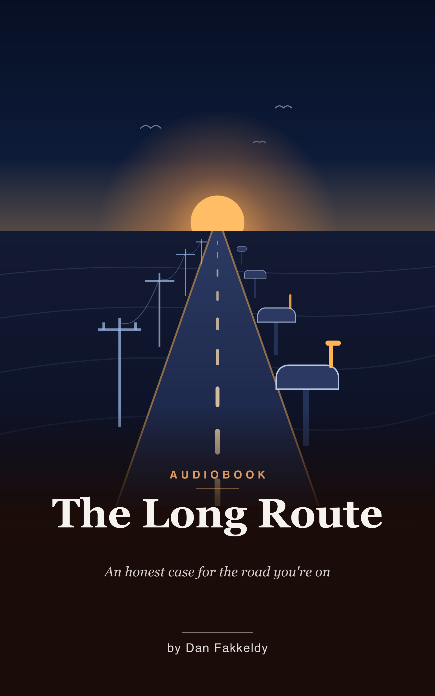

# The Long Route
_An honest case for the road you're on_

> On a bad day, there is a familiar move available: someone puts a hand on your shoulder and says *believe in yourself*. This book refuses to do that — not because the encouragement would be false, but because its listener is the kind of person who checks. So instead of a pep talk, it opens a ledger: everything that exists as of July 2, 2026, dated and sourced, zeros included. If optimism shows up, it has to arrive as a conclusion.

**The Long Route** is the one personal book in this library. It was written for the library's own curator — a 47-year-old rural mail carrier with no degree who taught himself iOS with AI agents starting in April 2026 — on a day when the honest revenue math felt like "not much hope." It asks the question directly: *is indie development the right career direction?* — and it argues the answer entirely from evidence: his own dated git history and devlogs, his ratified master plan's own conditional numbers, and named, sourced external cases. Its optimism is load-bearing or it is cut.

Most of the library teaches skills. This one steel-mans fears. Each of the five gets its strongest case *first*, then an answer from the record:

- **Too old at forty-seven** — answered with the founder-age research of Azoulay, Jones, Kim and Miranda (the average founder of the fastest-growing startups is forty-five), and with named late starters from Harold Cohen to Masako Wakamiya — honest scale included
- **No degree** — answered with what the store actually inspects (artifacts), and a self-generated, thirty-six-hour study library as the curriculum no campus issued
- **AI will make developers obsolete** — answered with the controlled studies on *both* sides (including the one where AI made experts slower), and the repos where one carrier ships like a team
- **The store is flooded** — answered with the real distribution data (most apps earn almost nothing — said plainly), and why trust, story, and niche authority are what get scarcer
- **The money is small** — answered by *agreeing*, quoting the plan's own bands verbatim, and walking the documented slow-years curves of Slopes, YarnBuddy, Nihongo and others

Then the case for this person specifically — the loop button that started everything, the route as laboratory and study hall, the honesty ledger as brand, the five apps that chain into a flywheel — and a sober definition of "right direction": not a guaranteed outcome, but compounding assets over a survivable floor, with brakes. It closes on the two weeks the book was generated for: an unfamiliar mail route in late July, a four-week-old app on the dash, and this book in the driver's ears.

## Who it's for

Its listener of one, first. And after him: anyone starting over in the middle of a working life — self-taught, credential-free, short on time and long on doubt — who wants their optimism argued, not asserted.

## Listen & read

13 chapters, about 4 hours at 1.25x speed (~45,100 words). Read along or load it into your player:
- **EPUB:** [the-long-route.epub](the-long-route.epub)
- **Markdown:** [the-long-route.md](the-long-route.md)

---

*Written by Fable 5 and Opus 4.8 (AI models — chapters one through nine by Fable 5, ten through thirteen by Opus 4.8, every chapter then adversarially verified against a per-chapter fact pack built from the real repos, notes, plan, and named external sources). No invented statistics, no composite characters, no revenue promises. Spot-checked, not expert-reviewed — see the collection's [honest disclosure](../../README.md#honest-disclosure).*
