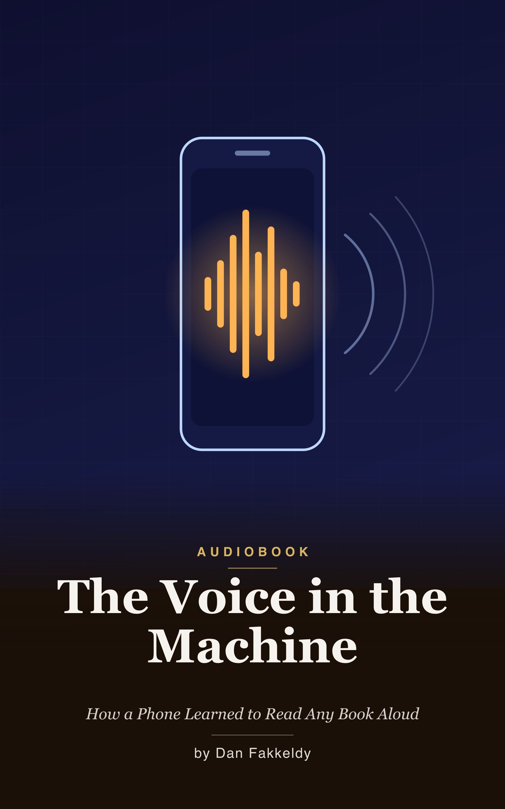

# The Voice in the Machine
_How a Phone Learned to Read Any Book Aloud_

> The dream is almost embarrassingly simple: what if your phone just read your book to you, out loud, in a voice that sounds like a person — privately, offline, for free? It turns out that tiny, reasonable wish opens a door onto one of the most interesting engineering stories there is.

This is a narrated, beginner's guide to how on‑device AI text‑to‑speech actually works — taught through one real example: Echo's narration feature, and the small neural voice model named Kokoro that powers it. Echo is a real, open‑source audiobook study player built by one solo developer, and its narration turns a text‑only ebook into a spoken audiobook entirely on the phone, with nothing sent to a server. So instead of a hand‑wavy "AI makes a voice," you follow the real pipeline, station by station — including the genuine war stories, like the crash that killed the app on older phones and the model swap that finally cured it. It's written entirely for the ear: no code or symbols read aloud, just plain‑English explanation you can follow on a walk or a commute.

The whole book follows one journey — written words going in one end of a tiny on‑device factory, and a human‑sounding voice coming out the other — with every station, and every honest tradeoff, explained along the way.

## What you'll learn
What "neural" speech really is and how it differs from the old robot voices; how raw ebook text gets cleaned before it can be spoken; how letters become sounds — phonemes, the phonetic alphabet, and a pronunciation dictionary; how you can teach the machine to say a word it doesn't know; what's actually inside the voice (an acoustic model and a vocoder, steered by a numeric "voice fingerprint"); what the Apple Neural Engine is, and the true story of an uncatchable crash it caused on older phones; why neural models are so fussy about the "shape" of their input, and how swapping in a fixed‑shape model fixed the crash; how long chapters are sliced, streamed to disk, and stitched into audio without exhausting a phone's memory; and finally how the words light up in time with the voice, how results are cached, and what is honestly still unfinished.

Threaded through it are four ideas: that running on your own device, privately, changes everything; that a phone's hard limits don't obstruct the design — they *are* the design; that every fix gives something up; and that the whole thing is really one long journey from symbols to sound.

## Who it's for
Curious near‑beginners who want to understand how modern AI voices work without wading through a line of code — and anyone who has ever wondered what's actually happening when a phone reads a book aloud.

## Listen & read
10 chapters, about 2.8 hours at 1.25x speed. Read it as an [EPUB](the-voice-in-the-machine.epub) or in [Markdown](the-voice-in-the-machine.md).

---

_Written by Opus 4.8, grounded in Echo's real on‑device narration pipeline. Spot‑checked, not expert‑reviewed — see the [honest disclosure](../../README.md#honest-disclosure)._
