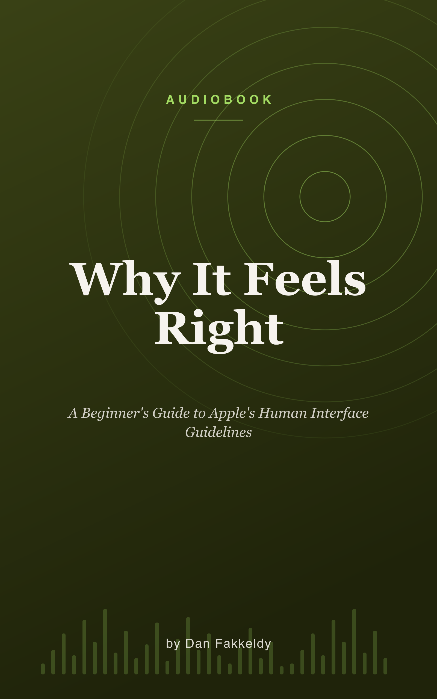

# Why It Feels Right

_A Beginner's Guide to Apple's Human Interface Guidelines, told through Echo_

> You have felt it, even if you have never had a word for it — the app that settles, and the one that quietly nags. This book gives you the words.

This is a narrated beginner's guide to Apple's design language — the written-down version of that feeling you cannot name. It teaches the Human Interface Guidelines not as a dry rulebook but through one real, shipping open-source app called **Echo**, an audiobook study player built by a solo developer with AI help. You will watch the rules work in a real product, and watch Echo break a few of them on purpose, for reasons it pays for. It is written entirely for the ear: no code, no symbols read aloud, just plain language and screens you already know by heart.

## What you'll learn

You start with the foundations everything rests on — the three core principles of **clarity, deference, and depth**, then the invisible scaffolding of **layout and the grid you never see**, **color that adapts** to light and dark and tired eyes, **type that breathes**, the small **language of glyphs**, and Apple's newest material, **Liquid Glass**.

From there you assemble an app out of its parts: the **bars** that frame the screen, the **buttons and controls** you push and slide, the **sheets** that interrupt you and when they have earned the right, and the **lists and collections** that hold everything in tidy rows.

Then you step back to the patterns — how people **move through an app** without getting lost, how it **greets a newcomer** in the first ten seconds, and how it **talks back** with progress, errors, and a buzz of haptics at the right moment. A full chapter on **designing for everyone** sits near the secret center of the book, not bolted to the end. You finish with **one app across many screens**, and the most advanced skill of all — **knowing when to break the rules, and how to break them well**.

## Who it's for

Anyone curious about why good design feels good — whether you build apps, are thinking about it, or just want to look at any screen and read it. No experience required.

## Listen & read

Seventeen chapters, about 4.5 hours at 1.25x speed. Grab the [EPUB](why-it-feels-right.epub) for your reader or audiobook app, or read the [combined Markdown](why-it-feels-right.md).

---

Written by Opus 4.8 (an AI model), grounded in Echo's real code and docs, and spot-checked rather than expert-reviewed. See the collection's [honest disclosure](../../README.md#honest-disclosure).
