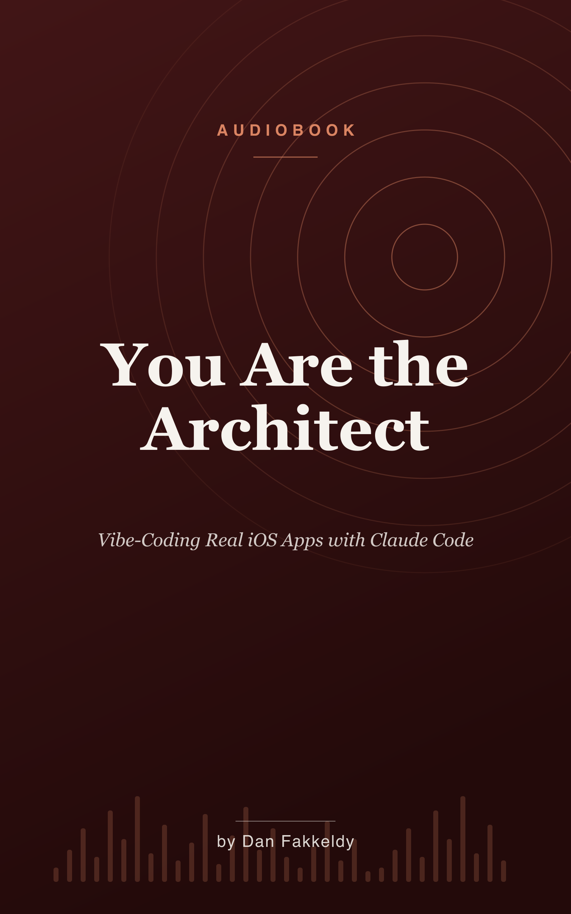

# You Are the Architect
_Vibe-coding real iOS apps with Claude Code_

> The machine does the building. You do the thinking. That difference is the whole book.

This is a narrated, beginner-friendly audiobook about actually building real software with an AI coding assistant — past the "build it while you sleep" fantasy and into the work that lasts. What makes it different: every idea is taught through one true, shipping, open-source app called **Echo**, an audiobook study player built by a single solo developer — a mail carrier on a modest sixteen-gigabyte Mac — by directing an agent rather than typing it all by hand. It's written for the ear, so no code or symbols are ever read aloud; you can listen on a walk and follow every word.

## What you'll learn

You start by meeting your new teammate and learning the difference between an assistant that suggests and one that *acts*. From there the journey builds outward, rail by rail:

- **Direction over abdication** — prompting well, setting the table once, and the art of the ask
- **Guardrails that can't be forgotten** — tests, automated checks, isolated workspaces, and proof instead of promises
- **Keeping the judgment yours** — reviews, an honest map of the code, and why architecture is still your job
- **The long game** — managing cost, surviving hard problems and fighting hardware, and building something that's still standing on Wednesday

Each chapter names a tradeoff out loud, because every choice — and every shortcut the agent proposes — quietly gives something up.

## Who it's for

Anyone curious about building real software with an AI coding agent — whether you've never shipped a line of code or you're an experienced developer deciding how much to trust the machine.

## Listen & read

Grab the [EPUB](you-are-the-architect.epub) for your audiobook or reading app, or read the [combined Markdown](you-are-the-architect.md). It runs to 24 chapters — about 6.7 hours at 1.25x speed.

---

_Written by Opus 4.8 (an AI model), grounded in Echo's real source and docs, and spot-checked rather than expert-reviewed. See the collection's [honest disclosure](../../README.md#honest-disclosure)._
