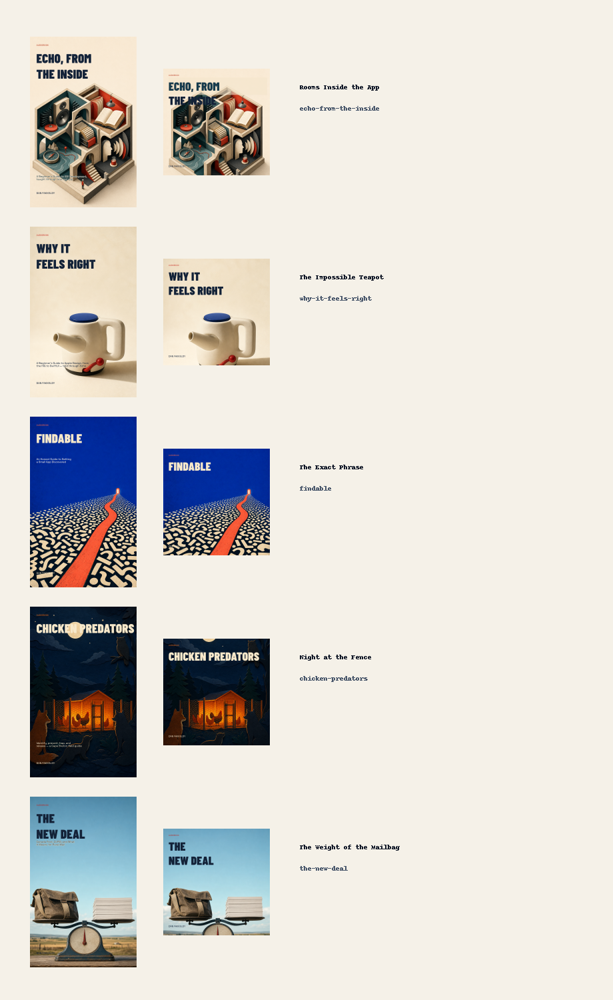

# Public paired-cover rollout — July 2026

Dan selected one reviewed portrait/square identity for each public learning
book on 2026-07-13. Selection source is `user`. Each pair was rerendered from
its recorded specifications and matched the reviewed output byte-for-byte
before promotion. Rodents in the Walls remained outside this rollout and its
complete Task 7 inventory remained byte-identical.

| Book | Selected direction | Public edition ID | Portrait SHA-256 | Square SHA-256 | Receipt SHA-256 |
| --- | --- | --- | --- | --- | --- |
| Echo, From the Inside | Rooms Inside the App | `12fec874-b101-4129-b1c3-a7a4b5a4792f` | `0fe641954a1f20016613596afbaa8a95dc218611077c276bb13aa8cc191c40d1` | `3fd3c6c167ba13f8080c67d2aeb315851f63a0e2955e970daab0cff77d435ff9` | `a06939bb93c60335c8179ce5c2c903ea906b21b549a797663f2a73558cba2e1b` |
| Why It Feels Right | The Impossible Teapot | `034b950f-5024-4f58-bcaf-6d984d241b50` | `3fbc32510e611766c150c6280dc0059b634d1c6d4f0923beec84291fb0e819b3` | `060252a5878ee62f05586c5583fd71862d58f35202dd7692c1a48942ccde84d4` | `e1a287ae9a78197f3b113c61d20c722cde7ce7fdf9c85d8da0cb9018d4cc96ba` |
| Findable | The Exact Phrase | `74d03cb1-c805-41ec-ac90-4f02277f6b9e` | `4b0ca55fb5e4f4edca32102c0fd3b49b67db1ed67399578ac8d241735501fe19` | `b56aec2a60d6a609bf416935791f03d3a612d9eb2837fd568c7a61815720b3e4` | `740492733ee69bc9ff62f3d8d1dbfc25aba60a93b01a779ae5d1033a8f42988f` |
| Chicken Predators | Night at the Fence | `54643b56-8f40-4315-839e-e4df670d456d` | `1745b28342f6e70061f5333f9c7f29e1e5adcbe726e111432f88563648b87210` | `18c6520b20c4ba39346d03e84a856eb1785968327cce69bdb58ce234f031d59d` | `d13eb40de8a1d67fb3a9e1d55f12aa7fe2898ba6a25ca2d987f2c8ee4b44b225` |
| The New Deal | The Weight of the Mailbag | `9f7f1202-acf1-4343-a99f-5b0f83da7c03` | `3d6ded0e0af6c9454d6a5712e78fbba84fb8aa4f0dbd72fd5ce7e72768d14a37` | `2034da6997ad9c451a3542049fbce5cfbc0203a6675a36bc405413de20a437c0` | `87f1a12509bd14ab95bde7aec45b65604e5e4db1b2d2db2f960cea6940754ed0` |

## Package invariants

- Every EPUB embeds its selected portrait bytes exactly and retains every
  non-cover member payload and ZIP metadata.
- Chicken Predators and The New Deal have public M4Bs. Their embedded artwork
  now matches the selected square pixels; audio packet hash, streams, duration,
  chapters, and format tags remain unchanged.
- Echo, Why It Feels Right, and Findable have no public M4B in this repository.
  Their governed square artwork is present for future audiobook/site use, but
  no nonexistent media package was synthesized.
- Each old portrait is preserved as `cover-pre-paired.png`; earlier
  `cover-legacy.png` history remains untouched.

Public M4B audio packet hashes retained:

- Chicken Predators: `05924d38b83beab43ac2942dc4426224e640440faed3cda1cdf43b5cb89610f5`
- The New Deal: `d8396f1a65f29844f3b89fc384f9448d070bd2d9324cadf7147d490388125116`

## iCloud decisions

- Chicken Predators was an exact match for the public edition by EPUB ID,
  non-cover EPUB identity, and complete M4B media signature. Governed dry-run
  and apply changed exactly the nine paired artifacts plus its own EPUB and
  M4B. Its unrelated offline-only `cover-3.png` remained unchanged and
  dataless. No checksum manifest existed in this legacy delivery folder.
- The New Deal used the same EPUB identifier but did not match the public
  edition's non-cover/media identity, so it was skipped. No repository edition
  was substituted into that folder.
- No exact-title iCloud folder existed for Echo, Why It Feels Right, or
  Findable, so all three were skipped.

The selected contact sheet SHA-256 is
`78de4dd0b4d41ce1bcb36eead9ecab9a271b42d67b171b2f7fb8868d21fb9332`.
