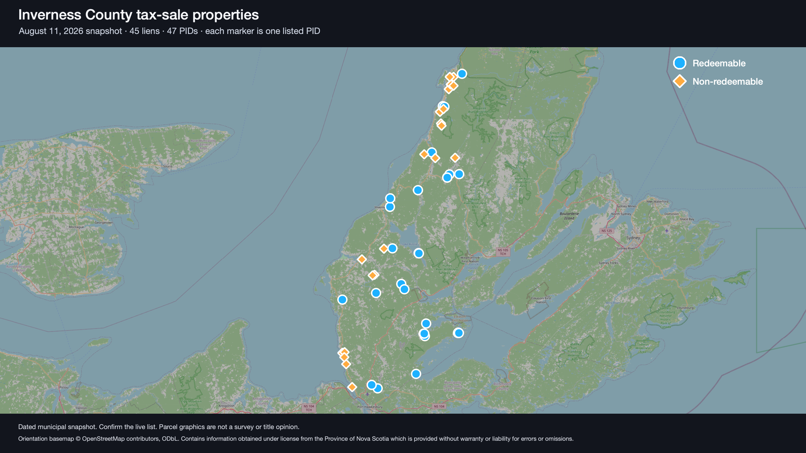
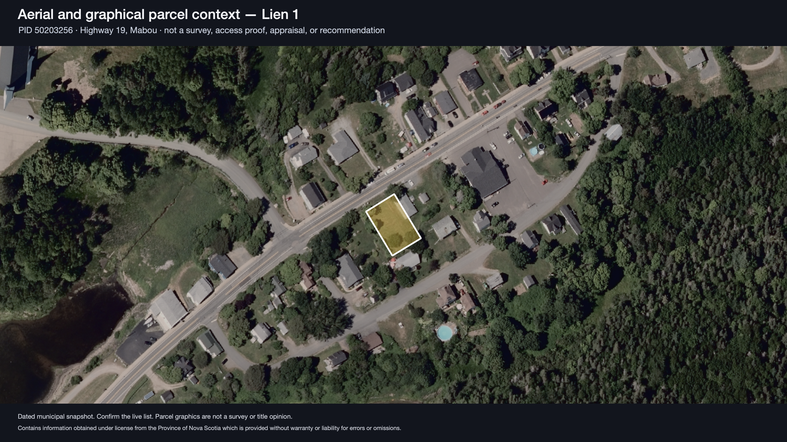
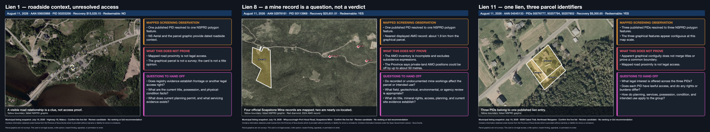

# Nova Scotia tax-sale audiobook development packet

## Beyond the Tax-Sale Packet

**Status:** the governed-final 54-figure EPUB and 4:12:50 audiobook have passed
package checks, completed Dan's full listening review and received explicit
publication authorization. The two Touquoy passages were accepted in context,
but their canonical pronunciation remains unverified. Portrait/landscape video
publication and second-device proof remain separate.

This packet records the development of a long, spoken-first educational book about Nova Scotia
municipal tax sales: terminology, the statutory process, municipal variation,
property research, auction behaviour, purchaser responsibilities, and the
questions that remain for qualified professionals. Inverness County's August
11, 2026 auction is the principal current case, with other Nova Scotia
municipalities used to distinguish provincial law from local procedure.

The finished public book is available at
[`books/beyond-the-tax-sale-packet/`](../../books/beyond-the-tax-sale-packet/).
Its purpose is civic explanation and a
demonstration of careful research—not investment promotion, a live-property
ranking, or an advertisement disguised as education.

## What is here

- `research/`: the public-safe research brief, official-source register,
  traceable evidence notes, fact pack, approved thirteen-chapter argument outline,
  structured learning records, Inverness dossier, municipal comparison,
  auction-result analysis, production-map research-chain plan and product
  feedback, accepted voice exemplar, pronunciation plan,
  conversation decision log, handoff packet, and approved-for-pilot 54-figure visual direction;
- `maps/data/`: an owner-free snapshot of the municipality-published August
  2026 listing facts;
- `maps/qgis/`: the editable QGIS 4.0.2 project used for the current proofs;
- `maps/exports/`: two attributed 2560-by-1440 development renders;
- `maps/atlas-prototypes/`: three owner-free QGIS 4 evidence-card prototypes
  plus full/phone contact sheets, specs, render receipt and hash-bound human
  visual-approval receipt;
- `maps/scripts/`: a reproducible local NSPRD/AMO source build and QGIS 4 render
  workflow;
- `figures/`: the deterministic diagram renderer, teaching/provenance
  specifications, paired contact sheets and hash-bound receipts, including 14
  production-map screens in both landscape and genuine mobile-browser profiles;
- `chapters/`: canonical Chapters 1–13, drafted sequentially from the accepted
  pilot and approved argument outline, including the major map-method rewrite
  and its access, intended-use, environmental, title, cost, auction, tender,
  payment, and failed-sale branches;
  and
- `chapters/images/`: the complete 54-figure landscape set, including 14
  refreshed 2560-by-1440 NS Marks The Spot walkthrough screenshots. All 54 are
  embedded in the governed-final public EPUB.

The schedule has 45 liens and 47 unique PIDs. NSPRD returned 53 polygon
features because four PIDs are represented by multiple mapped pieces. The map
project includes every listed PID; the county-scale proof uses large cyan and
orange halo markers over an OpenStreetMap orientation basemap and suppresses
individual lien labels at that scale. NS Aerial remains the detail basemap.

## What is deliberately absent

- assessed-owner names and owner-bearing municipal source extraction;
- raw municipal PDF/text snapshots;
- raw NSPRD geometry and aerial tile caches;
- Property Online plans, registry documents, or subscription-derived material;
- live-property scores, rankings, maximum bids, or recommendations;
- internal pricing and possible-service planning notes; and
- private governed renderer scratch and pronunciation-review artifacts; the
  public package includes only the verified M4B and portable alignment sidecar.

The interactive implementation remains in the
[NS Marks The Spot repository](https://github.com/dfakkeldy/ns-marks-the-spot)
and [live map](https://kinnokilabs.com/apps/nsmarksthespot/map/) rather than
being duplicated here. The 2026-07-22 paired screenshot receipt pins production
source commit `a7ba7da9ad5f8a5dcc1c67c79888bb76b6bae108`. This repository owns the
book-development packet, its reproducible QGIS proofs and version-stamped
chapter screenshots.

## Current publication status

The governed-final public edition is complete. It contains 13 chapters, 54
embedded figures, the selected *The Packet Lifts* portrait and square covers, a
4:12:50 chaptered `am_michael` M4B, and a 735-anchor alignment sidecar. Package
checks passed, Dan completed the full listening review, and he explicitly
authorized publication on 2026-07-23.

The final publication receipt is
[`research/audiobook-54-figure-publication-receipt.json`](research/audiobook-54-figure-publication-receipt.json).
It binds the accepted human verdict and authorization to the exact EPUB, M4B,
alignment, Markdown, covers, and figures. The public reader package is
[`books/beyond-the-tax-sale-packet/`](../../books/beyond-the-tax-sale-packet/).

The rendered Touquoy passages were accepted in the complete listen for this
edition, but the receipt does not claim that their pronunciation is canonical.
Second-device proof was not required for publication and remains incomplete.
No portrait or landscape video edition is published.

## Historical production timeline

- On 2026-07-19, Dan approved the earlier 12-chapter, 40-figure direction.
- On 2026-07-20, he approved the production-map-led 13-chapter, 51-figure
  direction and accepted the narrated comprehension pilot for continued
  drafting.
- On 2026-07-21 and 2026-07-22, he approved the manuscript and Chapter 5
  mineral-occurrence revision and selected Candidate 1, *The Packet Lifts*, as
  the paired cover.
- The first controlled audiobook candidate was rejected because **Pictou** was
  pronounced incorrectly. A replacement enforced the accepted **PICK-toe**
  reading for all five occurrences.
- On 2026-07-22, the visual edition expanded to 54 figures and received a fresh
  governed first-listen render.
- On 2026-07-23, Dan completed the full listen and authorized the exact
  54-figure edition for public release.

The pre-publication [handoff packet](handoff-packet.md) and
[full-audio acceptance checklist](audiobook-acceptance-checklist.md) remain in
place as superseded historical records. Their pending gates describe the dated
candidates they governed, not the current public edition.

The three accepted-direction atlas prototypes also remain development evidence.
The proposed remaining 42-card atlas batch is paused while the living map is
evaluated as the more useful parcel-orientation surface.

## Safety and currency

This material is educational only. It is not legal, tax, investment, title,
surveying, appraisal, access, environmental, insurance, planning, tenancy, or
construction advice. Municipal lists and procedures change. The legal and
event research was refreshed against official sources on 2026-07-19, the
Chapter 5 mineral-resource sources on 2026-07-22, and the Chapter 6–11
planning, access, environmental, title, occupancy, mobile-home,
auction-result, tax, eligibility, auction/tender, payment, failed-sale,
certificate, redemption, and insurance sources on 2026-07-20; readers must
consult the current statute, live municipal list, auction terms, and their own
qualified professionals before relying on a live-sale detail.

Principal current sources include the [Nova Scotia Municipal Government
Act](https://nslegislature.ca/sites/default/files/legc/statutes/municipal%20government.pdf),
the [Inverness County tax-sale page](https://invernesscounty.ca/services/finance-taxation/tax-sales/),
the [August 11, 2026 municipal packet](https://invernesscounty.ca/wp-content/uploads/2026/07/Tax-Sale_August-11.pdf),
the [NSPRD parcel service](https://nsgiwa2.novascotia.ca/arcgis/rest/services/PLAN/PLAN_NSPRD_WM84/MapServer/0),
and the [NS Aerial service](https://nsgiwa.novascotia.ca/arcgis/rest/services/BASE/BASE_NSODB_10k_WM84/MapServer).
The Lien 8 prototype additionally uses the Province's [DP ME 10 Version 9
Abandoned Mine Openings product](https://novascotia.ca/natr/meb/download/dp010.asp)
under the Nova Scotia Open Government Licence.

Rendered provincial-service views carry the required attribution inside each
image. See [the map workspace](maps/README.md) for the exact licence boundary
and reproduction steps.
