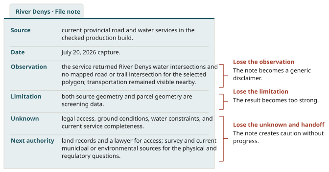
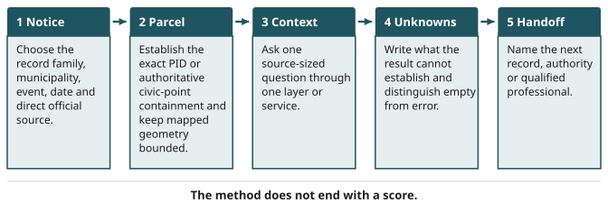

# Using the Map as a Research Tool

::: {.chain links="notice,parcel,context,unknowns,handoff"}
Research chain: **notice** → **parcel** → **context** → **unknowns** → **handoff**. This chapter
introduces the whole chain and works through each link on a public map.
:::

::: {.objectives}
1. Choose the record family (current notice or historical result) before reading any parcel.
2. Establish parcel identity by exact PID or authoritative civic-point containment, and state what
   containment does not prove.
3. Read mapped area, building counts, assessment, Plus Codes, intersections and flood results as
   bounded records.
4. Write a six-part note: source, date, observation, limitation, unknown, next authority.
5. Explain why a mineral occurrence opens questions about tenure and surface rights, using the
   Mineral Resources Act and the Touquoy example.
:::

::: {.keyterms}
- civic point
- Plus Code
- layer
- mapped intersection
:::

## Start with the record family {#sec-05-record-family}

### One screen, many authorities

NS Marks The Spot can place a tax-sale record, parcel outline, civic point, road, water feature and
geology symbol on one screen. That is its power and its main risk. The eye combines nearby marks
faster than the mind checks their sources.

A current notice, an old result, a graphical boundary and a coloured overlay can begin to feel like
one coherent property story. They were created by different authorities, for different purposes, at
different times. The map works best when it slows that combination down.

![**The map and its layers.** The production map, with its current and historical modes and the public layers available. Insets 1 and 2 magnify the mode switch and part of the layer list, where each layer shows its source date, scale and coverage. Production build of NS Marks The Spot, captured July 22, 2026. Contains information obtained under license from the Province of Nova Scotia which is provided without warranty or liability for errors or omissions. Screenshot from the 2026 edition (figure-41); the insets are magnified crops of the same image.](../assets/figures/kept/fig-05-map-layer-overview-inset.png){#fig-05-map-layer-overview alt="Production map with current and historical modes, current defaults and the available public layers visible. Magnified insets show the Current notices and Historical records switch, with current notices described as advertised notices that still require municipal verification, and the Modern map, NS Aerial and NS Property Boundaries layer entries with their source dates, scales and coverage."}

### Current notice or historical result

Begin before the parcel is visible: choose the **record family**. The map keeps two.

- **Current notices.** In the production build checked on July 22, 2026, the current-sale catalogue
  showed the Inverness August 11 event with 40 advertised records, 5 marked withdrawn, and 40
  active PIDs. That is a dated catalogue snapshot.
- **Historical records.** The historical catalogue is kept off by default. It contains dated results
  from completed events. It can also hold a recent event whose outcome remains explicitly unknown
  while official results are pending.

A current notice asks what a municipality presently says it intends to sell. A historical record
reports what the checked sources did or did not yet establish after an earlier event. They are not
two filters over one timeless collection. They are different kinds of evidence
([Figure 5.2](#fig-05-current-vs-historical)).

{#fig-05-current-vs-historical alt="Current notices and historical records are different kinds of evidence. A current notice says what a municipality presently intends to sell, and only the municipality's own current notice or direct confirmation controls whether the sale is live or a parcel remains listed; a copied PDF, screenshot, browser tab or map catalogue can become stale. A historical record reports a dated result from a completed event, is off by default, and can hold a recent event whose outcome remains unknown while official results are pending; an opening or winning amount from an older event does not become a present valuation. Examples: the Inverness August 11, 2026 event, snapshot checked July 22, 2026, with 40 advertised, 5 withdrawn and 40 active PIDs; a Halifax result for PID 00542589 from the March 8, 2022 event; and a CBRM record for PID 15234636 from the July 21, 2026 event, still awaiting official results. Name the record family before repeating any amount."}

The distinction protects against a simple but serious error. Three wrong inferences follow from
mixing the families:

| What the screen shows | What it does not mean |
|---|---|
| A historical parcel's marker on the same basemap as a current parcel | That the historical parcel is currently available |
| An opening amount or winning amount from an older event | A present valuation |
| A current entry still displayed in its dated snapshot | That the entry remains live |

### The direct source controls

Choose current mode and Inverness. The app exposes the event date, municipal source, snapshot
language, parcel list and the notice's published redemption category. The direct source link is the
most important control on that screen. It returns the researcher to the municipality that owns the
event record.

![**The current Inverness view.** The current-notice browser for the Inverness August 11 event, with its snapshot counts, redemption filters and the link to the direct official source. Inset 1 magnifies the tax-sale notice entry; inset 2, the redemption-category filter and the event card with its direct-source link. Production build of NS Marks The Spot, captured July 22, 2026. Contains information obtained under license from the Province of Nova Scotia which is provided without warranty or liability for errors or omissions. Screenshot from the 2026 edition (figure-43); the insets are magnified crops of the same image.](../assets/figures/kept/fig-05-current-parcel-browser-inset.png){#fig-05-current-parcel-browser alt="Inverness August 11 view showing 40 advertised records, 5 withdrawn records, 40 active PIDs, redemption filters and the direct official source. Magnified insets show the Tax-sale notices entry for Inverness County, August 11, 2026, with a snapshot retrieved July 22, 2026, and the redemption-category filter with an Open direct official source link."}

The app is a research index. The municipality's current notice or direct confirmation controls
whether:

- the sale is live;
- a parcel remains listed;
- the event has been postponed;
- a term has changed.

A copied PDF, screenshot, browser tab or map catalogue can become stale. The link is not a footnote
for later. It is part of the operating sequence.

::: {.case name="Birch Point Road"}
Composite case — not a real property.

Suppose the fictional Birch Point Road entry appears in the Inverness list. The researcher opens the
municipal notice and confirms that the event, exact lien, PID and relevant status still match the
file. If the direct notice and the app disagree, the disagreement is recorded. The app does not break
the tie in its own favour.
:::

### The production receipt

The same rule governs the production receipt. The book's inspectable production record preserves
the exact map build, capture date and interface checks used for its figures. The receipt establishes
which dated interface state produced the captured evidence.

![**The Province-data notice.** Before Province layers load, the map shows a notice with the Province attribution, the statement that property boundaries are approximate and not a legal survey, and a link to the licence. Insets 1 and 2 magnify the notice. Production build of NS Marks The Spot, captured July 22, 2026. Contains information obtained under license from the Province of Nova Scotia which is provided without warranty or liability for errors or omissions. Screenshot from the 2026 edition (figure-42); the insets are magnified crops of the same image.](../assets/figures/kept/fig-05-province-data-licence-inset.png){#fig-05-province-data-licence alt="Province-data notice in landscape and mobile layer-source metadata identify approximate boundaries, dated services and the licence boundary. Magnified insets show the notice headed Use Nova Scotia map data, the Province attribution, the statement that property boundaries are approximate and are not a legal survey, a link to read the Province licence, and the choice to accept and view map layers or continue without Province layers."}

Provenance makes change detectable. It does not make change stop.

### Parcel identity

After current status comes parcel identity. If the notice supplies an exact PID, search that PID.
The result selects the parcel returned for that identifier and opens its bounded evidence
sheet. The sheet can report:

- the selected PID;
- approximate area from mapped geometry;
- current notice association;
- mapped civic points;
- Plus Codes;
- service-derived context.

Every field keeps its own job.

**Mapped area.** The approximate mapped area is a calculation from the current parcel geometry. It
is useful for orientation and for comparison with other records. It is not a survey area, a deeded
acreage guarantee, or proof that the polygon represents every interest involved in the sale. The
word "mapped" should travel with the number.

**Mapped buildings.** The sheet also reports a mapped-building count and a dated PVSC
assessment account. In the checked demonstration for PID `50292390`, the building query returned two
Nova Scotia Topographic Database point or polygon features intersecting the mapped parcel. That count
does not establish:

- how many structures currently exist;
- whether any are occupied;
- their condition or use;
- whether they have permits.

A returned zero means that the checked query found no mapped feature. It does not prove an empty
parcel.

![**Mapped buildings and a dated assessment.** The parcel inspector for demonstration PID `50292390`. Inset 1 magnifies the mapped-area and mapped-building rows with their limits; inset 2, the PVSC assessment account with its valuation and physical-state dates. Production build of NS Marks The Spot, captured July 22, 2026. Contains information obtained under license from the Province of Nova Scotia which is provided without warranty or liability for errors or omissions. Screenshot from the 2026 edition (figure-52); the insets are magnified crops of the same image.](../assets/figures/kept/fig-05-buildings-assessment-inset.png){#fig-05-buildings-assessment alt="Parcel inspector showing two mapped building features, PVSC AAN 00616672, 2026 assessed and taxable values of $35,000, and the attached limitations. Magnified insets show the PID 50292390 sheet with its mapped area and a mapped-building count of 2, the note that an empty result does not prove no building exists and that the count does not establish current structures, occupancy, condition, use or permits, and the PVSC assessment account with the statement that the assessment is not today's sale price or an appraisal."}

**Assessment.** The same demonstration matched PVSC Assessment Account Number `00616672` and
displayed 2026 assessed and taxable values of $35,000. The sheet states the valuation and
physical-state dates behind that assessment and links the source. The amount is not today's sale
price, a current appraisal, a repair estimate or a bid ceiling.

The demonstration parcel is not presented as a current tax-sale listing. It is used because the two
fields make their separate evidence limits visible in one bounded inspector.

### Starting from a civic address

Sometimes the research begins with a civic address instead of a PID. The checked map searches the
provincial civic-address service. It uses the returned authoritative **civic point** and opens the
parcel polygon that contains that point. It does not choose the nearest parcel to a guessed
coordinate or fabricate an address between known points.

{#fig-05-civic-address-search alt="Exact civic-address result and selected parcel shown together, with authoritative-result language visible."}

**Containment** is a precise interface operation: this returned civic point falls inside this
returned parcel polygon. The operation does not prove:

- who owns or occupies the parcel;
- whether the point is the mailing address for every interest;
- whether a building sits at the point;
- whether the public can enter;
- whether there is legal access from the road.

The distinction matters when the picture feels obvious. A civic point may sit beside a visible
roof. The parcel polygon may touch a road symbol. The app can report both facts faithfully and still
have no authority to infer occupancy or right-of-way. Containment finds the parcel to investigate. It
does not finish the investigation.

{#fig-05-current-parcel-evidence alt="Selected parcel with authoritative civic result, Plus Code, mapped context and explicit evidence limits."}

### Plus Codes

The sheet also provides a **Plus Code**. A Plus Code encodes a location so it can be shared or
recovered without relying on a conventional street address. It lets a research team discuss the
same mapped point, especially in rural areas where address language is awkward or absent.

A Plus Code identifies a location, not a legal interest. It does not turn the point into a parcel
address, access route, entrance, building location or permission to visit. If a researcher sends the
code to a surveyor or inspector, the message should say what the point represents and how it was
obtained.

::: {.recall}
Coming back to a file after a break, recover four answers before anything else:

1. Was the screen in current or historical mode?
2. Which municipality and dated event owned the record?
3. Did the direct source still confirm the entry?
4. Was the parcel established by exact PID or authoritative civic-point containment?

Only after those answers are recovered should imagery or context layers return. The order prevents a
memorable shape from becoming the source of identity.
:::

### Boundary and imagery

The graphical parcel boundary and the aerial image are the next temptation. Together they can make
the parcel feel physically known. The line appears exact. The imagery supplies texture, buildings,
vegetation, water and roads. Yet both are dated services, and the parcel line remains graphical
boundary information rather than a survey.

{#fig-05-aerial-and-property-boundaries alt="Selected civic parcel on NS Aerial with graphical property-boundary linework and source attribution."}

The correct reading is source-specific:

- The current NSPRD graphical parcel service returned this polygon for the selected PID.
- The captured aerial service showed these visible features at its imagery date.
- The Province attribution and licence link remain on the public view.

The combination supports questions about apparent relationships. It does not locate a legal boundary
on the ground, certify current condition or authorize entry.

::: {.case name="Birch Point Road"}
Composite case — not a real property.

The fictional Birch Point Road file can now receive a map note.

::: {.filenote case="Birch Point Road"}
Current-mode Inverness entry confirmed against the direct municipal source on the recorded date.
Exact PID selected. Current parcel service returned mapped geometry and approximate mapped area.
Provincial civic service returned one contained civic point; the sheet supplied a Plus Code for that
point. Public boundary and aerial views are attributed screening context, not survey, occupancy,
access, or entry evidence.
:::

The note is longer than "found it", because "found it" conceals which thing was found. The event
record, parcel geometry, civic point and visible site are four different achievements.
:::

This stage of the map workflow has one deliberate landing point. The parcel is established strongly
enough to ask context questions and weakly enough that its unknowns remain visible. The screen is
ready to become a question machine.

::: source
NS Marks The Spot, source commit `d3114b5c` and production source receipt, checked July 20, 2026
(source no. 48): the integrated parcel record, exact-PID selection, approximate NSPRD mapped
area, mapped civic points and Plus Codes (evidence note MAP-001); the authoritative civic-address
lookup that opens the containing parcel and never substitutes a nearest or interpolated address
(MAP-002); the event-aware current-notice catalogue, which is a research index while the
municipality's current notice controls (MAP-003); the production deployment receipt, which does not
prove later reachability or service availability (MAP-004). Screenshots: production build captured
July 22, 2026 (screenshot receipt in the development packet). Property Valuation Services
Corporation, Find an Assessment and assessed-value history (no. 17, refreshed July 20, 2026): dated
mass-appraisal and taxation records (LAND-003). Province of Nova Scotia, NSPRD map service (no. 46)
and NS Orthophotomap Database service (no. 47), displayed under the Province of Nova Scotia
Restricted Geographic Services License version 1.0 with the required attribution (GIS-001,
GIS-002). GeoNOVA mapping products (no. 19): maps orient; they do not certify a boundary
(LAND-004).
:::

## One question at a time {#sec-05-one-question}

### Layers

A **layer** isolates one category of mapped information. Roads, water features, bedrock geology,
mineral occurrences, mineral tenure and abandoned mine openings come from different services with
different dates, coverage, geometry and institutional purposes. Turning several layers on at once
creates a rich picture. It also makes it hard to remember which source produced which mark.

The safer rhythm begins with one question, which names the source family before the result appears:

- Does the current road service report a line crossing the selected parcel geometry?
- Does the current water service report an intersection?
- Does the abandoned-mine-opening service return a point inside or near the selected polygon?

### Road and water: a demonstration

The checked production capture for PID `50308311` provides a useful road-and-water demonstration.
This is a real current-notice PID used to test the interface, not a recommendation or property
evaluation. The municipal location is Southside River Denys Road, Valley Mills. The parcel sheet
reports about 5.12 mapped acres.

Transportation context is visible nearby. The current service query reports no mapped road or trail
intersection with the selected parcel geometry. The water query returns River Denys features
intersecting that geometry.

{#fig-05-roads-water-context alt="Southside River Denys parcel sheet showing current notice facts, River Denys intersections and no mapped road/trail intersection. The magnified inset shows the roads at or beside the parcel listed as adjacent within 20 m, the note that adjacency and civic addressing are useful map context, not proof of legal access or road frontage, and River Denys water features listed as intersecting the parcel."}

That returned relationship is a **mapped intersection**: according to the query, the current service
geometry for a named feature crosses or overlaps the current parcel polygon. The result is stronger
than saying a coloured line looks close on the screen. It is narrower than saying the real-world
feature crosses the legal parcel exactly as shown.

### Reading the road result

For the road result, "no mapped intersection" does not mean no access.

- A right-of-way may exist outside the road dataset.
- A visible route may be private, unmapped, misaligned or legally irrelevant.
- The parcel geometry itself is not a survey.

The result routes the file toward title, plan, survey and municipal road questions.

Visible transportation nearby does not fill the gap. Nearness answers a spatial orientation
question. Legal access answers whether a recognized right permits the required passage. Chapter 6
will make that separation fail under pressure. Here, the map note keeps the two statements apart.

### Reading the water result

The water result says that the checked water-service geometry intersects the checked parcel geometry. By itself it does not:

- identify a wetland;
- establish flood risk;
- locate a surveyed watercourse boundary;
- determine a setback;
- report current ground condition.

The source and limitation determine the next question.

### Flood evidence

The inspector separates published river-study layers from current, 2050 and 2100 coastal scenarios.

- A 1-percent or 5-percent **annual-exceedance probability** describes the event mapped by a
  particular study, not a universal flood probability for every point in the PID.
- The coastal years are sea-level scenarios, not extra probabilities.

![**Flood evidence and its coverage.** The flood panel for PID `50292390` reports the parcel outside the four river-study extents and no intersecting pixels in the current, 2050 or 2100 coastal scenarios. Inset 1 magnifies the river and coastal results; inset 2, the panel's note on probabilities and scenarios. Production build of NS Marks The Spot, captured July 22, 2026. Contains information obtained under license from the Province of Nova Scotia which is provided without warranty or liability for errors or omissions. Screenshot from the 2026 edition (figure-53); the insets are magnified crops of the same image.](../assets/figures/kept/fig-05-flood-hazard-evidence-inset.png){#fig-05-flood-hazard-evidence alt="Flood evidence panel reports outside the four river-study extents and no current, 2050 or 2100 coastal pixel intersection, with the no-hazard caveat visible. Magnified insets show that river flood probability is not assessed outside the published study extents, that each coastal result is not proof of no coastal hazard, and that a 1% or 5% annual-exceedance probability describes the mapped flood event while the 2050 and 2100 values are sea-level scenarios, not additional probabilities."}

For PID `50292390`, the checked screen reported that the parcel lay outside the geographic extents of
the four published river-study layers. It also returned no intersecting pixels in the three coastal
scenarios. Neither result proves no flood hazard:

- Outside study coverage means the river question was not assessed.
- An empty raster intersection is an approximate screen, not a survey, elevation certificate,
  insurance finding or site-specific analysis.

### A note in six parts

A strong note for the road-and-water screen has six parts.

::: {.filenote case="River Denys"}
**Source:** current provincial road and water services in the checked production build.

**Date:** July 20, 2026 capture.

**Observation:** the service returned River Denys water intersections and no mapped road or trail
intersection for the selected polygon; transportation remained visible nearby.

**Limitation:** both source geometry and parcel geometry are screening data.

**Unknown:** legal access, ground conditions, water constraints, and current service completeness.

**Next authority:** land records and a lawyer for access; survey and current municipal or
environmental sources for the physical and regulatory questions.
:::

Source, date, observation, limitation, unknown and handoff travel together. Each part protects the
note from a different failure ([Figure 5.11](#fig-05-six-part-note)):

- If the note loses its limitation, the result becomes too strong.
- If it loses the observation, it becomes a generic disclaimer.
- If it loses the unknown and handoff, it creates caution without progress.

{#fig-05-six-part-note alt="Anatomy of a research note, using the River Denys example: source (current provincial road and water services in the checked production build), date (July 20, 2026 capture), observation (River Denys water intersections and no mapped road or trail intersection for the selected polygon; transportation remained visible nearby), limitation (both source geometry and parcel geometry are screening data), unknown (legal access, ground conditions, water constraints and current service completeness) and next authority (land records and a lawyer for access; survey and current municipal or environmental sources for the physical and regulatory questions). Lose the limitation and the result becomes too strong; lose the observation and the note becomes a generic disclaimer; lose the unknown and handoff and the note creates caution without progress."}

### Geology and resources

The geology and resource screen follows the same rhythm. The checked map can display bedrock
geology, mineral occurrences, mineral tenure and abandoned mine openings. Those layers are useful
because rural land can have a history or subsurface context that is not visible in an aerial image.

![**Geology and resource layers.** A selected parcel with the geology and resource controls active and their map symbols visible. A visible symbol opens a records question; it does not establish a reserve, ownership of mineral rights, contamination or danger. Production build of NS Marks The Spot, captured July 22, 2026. Contains information obtained under license from the Province of Nova Scotia which is provided without warranty or liability for errors or omissions. Screenshot from the 2026 edition (figure-48).](../assets/figures/kept/fig-05-geology-resources.png){#fig-05-geology-resources alt="Selected parcel with geology and resource controls active and map symbols visible."}

The useful question is never "Is this mineral land?" Begin with the particular service:

- Does the current layer return a mapped occurrence or opening within the selected area or a defined
  screening distance?
- What does that dataset claim to represent?
- What date and coverage statement accompany it?
- Which provincial record can explain the feature?

Each layer has a limit:

| Layer result | What it does not do |
|---|---|
| A visible **mineral occurrence** | Establish a reserve, ownership of mineral rights, economic potential, contamination or danger |
| An abandoned-mine-opening point | By itself, locate every underground working or describe current site condition |
| **Mineral tenure** geometry | Tell a surface owner what can happen without the governing records and legal framework |

::: source
NS Marks The Spot, source commit `d3114b5c` (source no. 48): the parcel sheet's road and
water context (MAP-001); the River Denys road-and-water demonstration for PID
`50308311`, an interface demonstration that proves neither legal access nor no access and is not a
wetland, flood, survey, title or site-condition opinion (MAP-005); bedrock geology, mineral
occurrences, mineral tenure and abandoned-mine-opening layers, whose results do not establish
reserves, mineral rights, contamination, safety, economic potential or absence (MAP-006). Nova
Scotia, Coastal Hazard Map User Guide (no. 22, refreshed July 20, 2026): current, 2050 and 2100
scenarios are planning clues, not parcel-specific engineering, insurance or development conclusions
(ENV-004). Screenshots: production build captured July 22, 2026; the capture receipt records that
outside flood-study coverage or no returned pixels is not proof of no hazard.
:::

## A small find, and a larger property question {#sec-05-small-find}

::: {.note label="From the author"}
Around 2015, I used a provincial mineral-occurrence record to choose a brook for recreational gold
panning. The record did not promise gold. It gave me a reason to look. I bought a pan, tried the
brook, and found a little colour. It would never pay the bills, but it was a memorable demonstration
of what a public geological record can do. I am leaving the brook unnamed because its location is
not the lesson.
:::

On a property file, the same observation would not automatically belong in the benefits column. Gold
nearby can be recreationally interesting and still raise separate questions about mineral tenure,
surface access and future land use. The layer establishes a recorded occurrence at its mapped
location. It does not establish who may explore, whether mining is economically possible, or what
could happen on a particular surface parcel.

### What the Mineral Resources Act provides

Nova Scotia law makes that distinction concrete. Under the **Mineral Resources Act**:

- The Crown owns the minerals.
- A mineral-right holder or prospector who cannot obtain the owner's or occupier's consent may apply
  to the Minister for surface-access rights.
- A mineral lessee who cannot acquire land or an interest needed for a mine, or for a purpose
  connected with or incidental to one, may apply for a **vesting order**.
- Once filed, the vested land or interest is deemed expropriated.

### The Touquoy example

The power is not merely theoretical. In 2012 the Province granted DDV Gold vesting orders for 14
parcels needed for the proposed Touquoy mine after acquisition agreements could not be reached. The
Supreme Court of Canada later refused leave in Forrest Higgins's challenge involving part of his
family's tree farm.

Touquoy did later produce gold, so "the mine found nothing" would be inaccurate. The narrower lesson
is stronger: the Act can reach land needed for mine-connected purposes, not only the spot from which
ore is taken.

### Questions, not a verdict

For a researcher, "gold nearby" is neither a bonus nor an automatic rejection. It opens questions:

- Which occurrence was returned?
- What tenure exists?
- Which surface rights may be involved?
- What does the current law permit?

Those questions belong under unknowns and handoff. The map still does what the pan did years ago: it
tells us where a worthwhile question begins.

### Empty is not a negative finding

An empty view has an equally strict limit. It means the current query returned no displayed feature
under the current settings and service response. It does not prove that:

- no feature exists;
- no historic activity occurred;
- the site is clean;
- the service is complete.

Loading, empty and error are separate interface states, because silence can otherwise be mistaken
for a negative finding.

### The handoff follows the result

The handoff changes with the result:

| Result | Where it may go, or what it may require |
|---|---|
| A named provincial geology record | May go to a geoscience source or qualified professional |
| A tenure question | May require the authoritative registry and legal interpretation |
| A mine-opening or possible site-condition question | May require current records, lawful inspection, and an environmental or engineering professional |

The map supplies the address of the question, not the answer expected from the professional.

::: source
Dan Fakkeldy's firsthand account of recreational panning around 2015; the brook is intentionally
unnamed (evidence note MAP-008). Nova Scotia Legislature, Mineral Resources Act, consolidated to
April 9, 2026 (source no. 50, refreshed July 22, 2026): Crown ownership of minerals, s. 5;
private-land consent and surface-access applications, ss. 25–26 (MIN-001); mine-connected vesting
orders and deemed expropriation, s. 27 (MIN-002). Government of Nova Scotia, "Decision Allows
Touqouy Gold Project to Move Ahead", June 15, 2012 (no. 51), Supreme Court of Canada Bulletin of
Proceedings, February 28, 2014, file 35540 (no. 52), and CBC, "Gold mine demands family tree farm
property", April 24, 2012 (no. 53): the vesting orders and the refusal of leave (MIN-003). Evidence
boundary recorded in MIN-003: the Touquoy case predates the current 2016 Act; it shows the vesting
mechanism has been used, not how a future application would be decided. Nova Scotia Department of
Natural Resources, Information Circular ME 84 (no. 54): Touquoy's later gold production (MIN-004).
NS Marks The Spot, source commit `d3114b5c` (no. 48): explicit loading, empty and error states
(MAP-001).
:::

## Historical mode {#sec-05-historical}

### The historical catalogue

Historical mode tests a different kind of restraint. Switch away from current notices and open the
dated historical catalogue. The interface can filter by municipality, year and recorded outcome. It
labels historical records and links the selected record to the official notice and, when one exists,
the official result source.

{#fig-05-historical-outcomes-overview alt="Historical mode showing 154 records, 161 exact matched PIDs, municipality, year and outcome filters, and explicit outcome-unknown language."}

### A completed result: Halifax, March 8, 2022

One captured Halifax example uses PID `00542589` from the March 8, 2022 event. The sheet displays the
recorded opening amount and winning amount, with derived difference or ratio fields. Those figures
answer a bounded historical question: what did the checked official records report for that PID at
that event?

![**A historical result sheet.** The Halifax result for PID `00542589` from the March 8, 2022 event, with its official notice and result links, difference and ratio fields, and historical disclaimer. Inset 1 magnifies the record's status and date; inset 2, the amount, ratio and source rows with the disclaimer. Production build of NS Marks The Spot, captured July 22, 2026. Contains information obtained under license from the Province of Nova Scotia which is provided without warranty or liability for errors or omissions. Screenshot from the 2026 edition (figure-50); the insets are magnified crops of the same image.](../assets/figures/kept/fig-05-historical-outcome-sheet-inset.png){#fig-05-historical-outcome-sheet alt="Halifax March 8, 2022 result sheet with official notice/result links, difference/ratio fields and historical disclaimer. Magnified insets show the record marked Sold, March 8, 2022, as a historical record; its opening bid, winning bid, difference and ratio rows; links to the official notice and official result; and the statement that it is a dated outcome only, not a current offering, and does not prove present ownership, title, redemption, legal access or parcel status."}

They do not answer what the parcel is worth now. The result:

- is not a comparable sale model;
- does not predict competition at another auction;
- does not establish a discount;
- does not supply a bidding ratio.

Tax-sale outcomes occur inside their own legal, physical, market, information and participation
conditions. The direct official sources remain attached so the record can be audited rather than
remembered as a floating number.

### A pending result: CBRM, July 21, 2026

A newer Cape Breton Regional Municipality (CBRM) record demonstrates the opposite case. PID
`15234636` appears in the July 21, 2026 historical event with the minimum bid and notice fields, but
the winning-bid field says "Awaiting official results." The event page says results will be posted
after payment is confirmed.

The record therefore claims no sale outcome, no purchaser, and no inference about present ownership
or parcel status. Moving a dated notice into historical mode after its event date does not
manufacture a result that the municipality has not published.

![**Outcome pending.** A CBRM record for PID `15234636` from the July 21, 2026 event, marked outcome pending: it carries the minimum bid and notice fields, the winning bid reads "Awaiting official results". Inset 1 magnifies the record's status and date; inset 2, its rows, the pending-results note and its limitation. Production build of NS Marks The Spot, captured July 22, 2026. Contains information obtained under license from the Province of Nova Scotia which is provided without warranty or liability for errors or omissions. Screenshot from the 2026 edition (figure-54); the insets are magnified crops of the same image.](../assets/figures/kept/fig-05-cbrm-outcome-unknown-inset.png){#fig-05-cbrm-outcome-unknown alt="CBRM July 21, 2026 record marked Outcome pending, with minimum bid, Awaiting official results, official links and dated-notice-only limitation. Magnified insets show the Outcome pending status dated July 21, 2026, the minimum bid, a winning bid of Awaiting official results, the note that CBRM says results will be posted after payment is confirmed, links to the official notice and official results, and the statement that this is a dated notice record only and claims no result."}

### What historical context can teach

A catalogue of results shows that advertised properties are sometimes removed, that opening and
winning amounts differ, and that outcomes vary. The lesson is about process and evidence.

::: {.rail label="In practice"}
A current parcel and a historical result may both have been on the screen during one session.
Before repeating any amount, say which record family it came from: "This is a historical Halifax
result from March 8, 2022," or "This is a current Inverness notice snapshot for August 11, 2026."
Naming the record family restores the boundary.
:::

::: source
NS Marks The Spot, source commit `d3114b5c` (source no. 48): verified historical outcomes kept
off by default, filtered by municipality, year and outcome, linked to official notice and result
sources, and labelled historical; a historical opening amount, winning amount, difference or ratio
describes that recorded event and is not current value, a comparable sale, a bid instruction or a
forecast (evidence note MAP-007). Screenshots: production build captured July 22, 2026.
:::

## The whole method {#sec-05-whole-method}

### Five words

The full map method fits into five durable words: **notice, parcel, context, unknowns, handoff**
([Figure 5.16](#fig-05-research-chain)).

| Link | What it means |
|---|---|
| Notice | Choose the record family, municipality, event, date and direct official source. |
| Parcel | Establish the exact PID or authoritative civic-point containment, and keep mapped geometry bounded. |
| Context | Ask one source-sized question through one layer or service. |
| Unknowns | Write what the result cannot establish, and distinguish empty from error. |
| Handoff | Name the next record, authority or qualified professional. |

{#fig-05-research-chain alt="The research chain in five links: notice, parcel, context, unknowns, handoff, each with its one-line job. Notice: choose the record family, municipality, event, date and direct official source. Parcel: establish the exact PID or authoritative civic-point containment and keep mapped geometry bounded. Context: ask one source-sized question through one layer or service. Unknowns: write what the result cannot establish and distinguish empty from error. Handoff: name the next record, authority or qualified professional. The method does not end with a score."}

### More useful, more unknowns

::: {.case name="Birch Point Road"}
Composite case — not a real property.

Consider a combined fictional research state for Birch Point Road:

- The current municipal notice is confirmed.
- The exact PID returns mapped geometry.
- A civic point and Plus Code supply orientation.
- The road query creates an access question.
- A water result creates a source-and-condition question.
- A resource overlay creates a records question.

The screen has become more useful while the number of explicit unknowns has increased.
:::

{#fig-05-combined-parcel-research alt="Soapstone Mine Road parcel sheet, civic results, Plus Codes, road/water observations and geology/resource layers together."}

That increase is success. An investigative tool earns trust by showing where knowledge ends, not by
making uncertainty disappear behind a polished parcel sheet.

The final file entry reads:

::: {.filenote case="Birch Point Road"}
Current notice confirmed at the direct municipality; exact PID established. Public services returned
the recorded parcel, civic, road, water, and resource context on the stated date. These are
screening observations from named services, not survey, title, access, occupancy, environmental,
resource-value, condition, or development conclusions. Resolve the registered access question with
land records, legal review, and survey evidence; route water, geology, or site-condition questions
to the current authoritative sources and qualified professionals before deciding whether the project
can proceed.
:::

### What the map has done

The map has done something substantial without pretending to have done everything:

- It has shortened the route from public notice to precise questions.
- It has preserved the authority of the municipality, Province sources, land records and
  professionals.
- It has made one parcel easier to investigate and harder to romanticize.

That is the job of a question machine.

::: source
NS Marks The Spot, source commit `d3114b5c`, production source receipt and live public map, checked
July 20, 2026 (source no. 48): the combined sheet is a screening record, not a survey, title
opinion, access opinion, inspection, valuation or development approval (evidence notes MAP-001 to
MAP-003, MAP-005 to MAP-007). Screenshots: production build captured July 22, 2026.
:::

::: {.summary}
- Choose the record family first. A current notice says what a municipality presently intends to
  sell; a historical record reports a dated result or a pending one. The July 22, 2026 Inverness
  snapshot (40 advertised, 5 withdrawn, 40 active PIDs) is a dated catalogue state.
- The municipality's current notice or direct confirmation controls whether a sale is live or a
  parcel remains listed. The app is a research index and does not break a tie in its own favour.
- Establish identity by exact PID or by the parcel that contains an authoritative civic point.
  Containment finds the parcel to investigate; it does not prove ownership, occupancy, public entry
  or legal access.
- Mapped area, mapped building counts, PVSC assessments and Plus Codes each keep their own limits:
  not a survey area, not occupancy or condition, not today's sale price, not a legal interest.
- Ask one question per layer. A mapped intersection is stronger than "looks close" and narrower than
  proof that the real feature crosses the legal parcel; "no mapped intersection" does not mean no
  access, and outside flood-study coverage means the river question was not assessed.
- Keep source, date, observation, limitation, unknown and next authority together in every note.
- A mineral occurrence opens questions about tenure, surface access and current law. Under the
  Mineral Resources Act the Crown owns the minerals, and a vesting order can reach land needed for
  mine-connected purposes.
- An empty view is not a negative finding, and a historical amount is not a present value. The
  method ends with a handoff, not a score.
:::

::: {.check}
1. On July 22, 2026, the map's catalogue showed Inverness's August 11 event with 40 advertised
   records, 5 withdrawn and 40 active PIDs. What does that establish, and what controls whether a
   parcel is listed today?
   [Answer](#ans-05-1)
2. A civic-address search returns an authoritative civic point, and the map opens the parcel that
   contains it. Name three things containment does not prove. [Answer](#ans-05-2)
3. The inspector for PID `50292390` reports two mapped buildings and 2026 assessed and taxable
   values of $35,000. What does each figure fail to establish? [Answer](#ans-05-3)
4. For PID `50308311`, the road query reports no mapped road or trail intersection. Does that mean no access? Where does the result route the file? [Answer](#ans-05-4)
5. One road-and-water note drops its limitation; another drops its unknown and handoff. What goes
   wrong in each? [Answer](#ans-05-5)
6. A Halifax sheet shows opening and winning amounts for PID `00542589` at the March 8, 2022
   event. Why aren't they a present value or a bidding ratio, and what does
   the CBRM record for PID `15234636` show about pending results? [Answer](#ans-05-6)
:::
