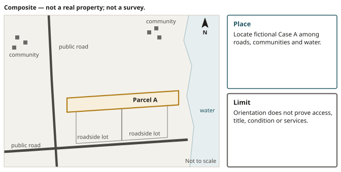

# Access and Intended Use

::: {.chain links="context,unknowns,handoff"}
Research chain: notice → parcel → **context** → **unknowns** → **handoff**. This chapter takes one
context question, access, and follows it to the unknowns it leaves and the professionals who can
answer them.
:::

::: {.objectives}
1. Separate a visible route, a legal right to reach the land, and a route capable of serving a
   project.
2. Define right-of-way, road frontage and zoning, and say what each one does not settle.
3. Frame a planning call around an exact PID and a named use.
4. Explain why favourable answers do not merge into a permit, and write a rational no.
:::

::: {.keyterms}
- right-of-way
- road frontage
- zoning
:::

## The route you can see {#sec-06-route}

::: {.case name="Maple Ridge"}
Composite case — not a real property.

The fictional Maple Ridge sliver looks easy from a kitchen table. Its long, narrow shape lies just
behind two roadside lots. A pale track leaves the public road, crosses one of those lots, and seems
to continue into the sliver. The auction recovery amount is modest. The aerial image gives the route
a beginning, a middle, and an apparent destination.
:::

{#fig-06-case-a-orientation alt="Wide map locating fictional Parcel A among communities, public roads and water, with north arrow; the map is marked not to scale. Parcel A is a long, narrow sliver just behind two roadside lots on a public road. Place: locate fictional Case A among roads, communities and water. Limit: orientation does not prove access, title, condition or services."}

That image can carry a researcher farther than the evidence does.

### From an empty result to a visible route

Chapter 5 left one map result deliberately unresolved. Transportation may be visible nearby even
when the checked service reports no mapped road or trail intersection with the selected parcel
geometry. The correct note does not turn that empty result into "landlocked", and it does not turn a
nearby line into "accessible". It records the source, date, result, limitation, unknown, and next
authority.

Maple Ridge presents the same discipline in a more seductive form. Here, the route is visible. Tire
marks appear to join the road. The parcel polygon seems to meet the pale track at its far end. A
researcher could point at the screen and describe how to get there.

The missing question is whether anyone acquiring an interest in the sliver has a legally supportable
right to use that route for the intended purpose.

### At the road edge

Stand, in imagination, at the edge of the public road. The track is a physical opening, and the
image cannot say much more about it:

- It might have been used by a neighbour, a former owner, a forestry crew, or no one for years.
- The graphical parcel line might be slightly displaced from the feature on the ground.
- The route might cross land belonging to someone else.
- A gate, washout, seasonal condition, or disagreement could exist beyond the age and resolution of
  the image.

None of those possibilities can be resolved by walking in to have a look.

::: careful
A tax-sale listing does not authorize entry. In the CBRM guidance used as an operational comparison
in this book, the municipality does not provide access; every other event still requires its own
current terms and lawful access route.
:::

### Three professions, three questions

The title and plan research now has a precise job. It must ask:

- whether the sliver benefits from a registered interest or other legally supportable route over
  the intervening land;
- where that route lies;
- what it permits;
- what conditions or obligations accompany it.

Three different authorities can answer parts of that job:

| Who | What they can do |
|---|---|
| A lawyer | Interpret the relevant records and legal effect |
| A surveyor | Address where described boundaries and routes relate to the ground |
| The municipality or road authority | Answer its own road-status and development questions |

One profession does not silently perform the work of all three.

### Right-of-way

A **right-of-way** is a right of passage over land. In a parcel file, the phrase cannot be treated
as a magic label. The source matters. The benefiting and burdened lands matter. The description,
route, permitted users, purposes, width, maintenance terms, and any conditions may matter.

A route adequate for occasional foot passage is not automatically adequate for vehicles,
construction traffic, utilities, emergency response, or year-round residential use.

::: {.rail label="A way to picture it"}
The visible track is like a door. Evidence of a sufficient right-of-way or public-road relationship
is the key that may authorize passage. The analogy is useful because a door can be obvious while
authority to open it is absent. Its limit is equally important: a real right-of-way is not a
universal key. Its scope and obligations come from law and the particular records, not from the
appearance of a path.
:::

{#fig-06-case-a-access alt="Terrain map showing Parcel A, a nearby public road, a dashed visible track, steep contours and a question mark where legal access would need proof. The track leaves the public road and crosses a roadside lot toward the parcel. Visible approach: a road or track on a map is a screening clue. Legal access: registry and legal review must answer the right-of-way question. Terrain: contours and drainage change site questions, not legal rights."}

### What the notice, the map and the deed do not supply

Maple Ridge's municipal sale notice does not supply that key. The notice identifies the sale entry
and routes the researcher toward the exact parcel. The public map supplies orientation and a bounded
picture.

A tax deed may later change the purchaser's registered interest according to the governing process,
but it does not invent a missing route across a neighbour's land.

{#fig-06-case-a-identity alt="Parcel A highlighted with three fictional record identifiers and a prominent not-a-survey warning. A card lists a lien number, AAN and PID, with their digits masked, pointing to the parcel. Lien, AAN and PID: fictional Case A identifiers point to one research target. Boundary: the graphical outline is not a survey or title opinion."}

### Changing the facts

Three variations follow. Each adds a clue, and each clue still leaves a question.

**An old plan shows the track.** Suppose the authorized record search finds an old plan showing the
pale track. That is useful. It is still a question, not yet an answer:

- Was the line surveyed as a boundary, drawn as an existing road, proposed as a route, or tied to a
  registered interest?
- Does the current parcel benefit?
- Is the description clear enough to locate?
- Has later work changed the physical route?

The plan, related instruments, current survey evidence, and legal interpretation must be reconciled
rather than ranked by which picture looks most convincing.

**The track is in daily use.** Now change one fact. The track is maintained, snowplowed, and used by
the owner of the front lot. Familiar use still does not establish that Maple Ridge has the right it
needs. Long use can raise legal questions, but a bidder should not invent the answer from local
habit. The people using a route may have permission, rights tied to different land, or a dispute.

**The polygon touches the road.** Change another fact. The parcel polygon appears to touch the
public road at one corner. Parcel maps orient research; they are not boundary surveys. A sliver of
apparent contact on a screen cannot carry the burden of proving legal access. The researcher needs
the description, survey and road evidence appropriate to the decision.

### The access note

The access note for Maple Ridge is short:

::: {.filenote case="Maple Ridge"}
**Observation:** Current parcel and aerial services show a driveway-like route from the public road
toward the selected graphical parcel. The route appears to cross an intervening parcel.

**Limitation:** Public mapping does not establish the legal boundary, road status, right to pass,
physical condition, or permission to enter.

**Next authority:** Required next evidence: title instruments and plans interpreted for the exact
parcel, survey advice where location is material, and confirmation from the responsible road and
planning authorities for the intended use.
:::

That note is actionable without pretending that the route is good or bad. It also creates a stop
condition. Suppose the intended project depends on vehicle, construction, utility, or emergency
access, and the required right cannot be supported before the bid decision. Then the gap is not
softened by a low recovery amount. It remains a no-go uncertainty.

The parcel may still be useful to someone whose existing land already supplies the necessary
relationship, or for a purpose that requires something different. That possibility does not make it
suitable for the fictional bidder's project. Suitability belongs to a named use and a named evidence
file.

::: {.rail label="The idea"}
At the road edge, the essential distinction is now stable:

- Getting near the land is a physical observation.
- Having a right to reach it is a legal conclusion that must be supported.
- Having a route capable of serving the project is a further physical and regulatory question.
:::

Maple Ridge has not failed because the screen is incomplete. It has revealed the exact fact the
screen cannot supply. Before the researcher asks what can be built there, the apparent driveway must
survive as more than a line the eye can follow.

::: {.recall}
1. What does a visible track establish? **A physical observation**: getting near the land.
2. What must a right to reach the land be? **A legal conclusion that must be supported**, from the
   records, a lawyer and, where location is material, a surveyor.
3. What is still open once a right is supported? **Whether the route can serve the project**, a
   further physical and regulatory question.
:::

::: source
CBRM, Tax Sales page and FAQ, refreshed July 20, 2026 (source no. 7): the municipality does
not provide access and cannot authorize a bidder to enter (evidence note LAND-007). Legal access is separate from visual access: a visible road, a driveway used in practice
or a line on an online map does not by itself prove legal frontage or a registered right-of-way
(LAND-005; CBRM land-locked parcel guidance; Property Online, no. 15). GeoNOVA mapping products
(no. 19): parcel maps are orientation tools that do not certify the boundary on the ground
(LAND-004). Municipal Government Act, ss. 155–156, and Halifax Regional Municipality Charter,
ss. 170–171: the tax deed's effect, with appurtenant and burdening easements or rights-of-way
continuing as the statute specifies (LAW-012). The Chapter 5 empty road result: NS Marks The Spot,
production capture of July 20, 2026 (no. 48; MAP-005).
:::

## The use the parcel must support {#sec-06-use}

::: {.case name="Maple Ridge"}
Composite case — not a real property.

Assume the access research on the fictional Maple Ridge sliver improves. A lawyer finds a
registered passage right that appears to benefit Maple Ridge. A surveyor can relate its description
to the ground. The fictional bidder wants a small year-round house.

The parcel has crossed one threshold. It has not crossed the others.
:::

{#fig-06-case-a-planning alt="Map of fictional Parcel A with zoning colour, frontage dimension, well and septic question icons, and a planner-confirmation callout. Zone A is hatched to the west and a second zone, marked with a question mark, lies to the east. Zone: confirm the current rule and intended use in writing. Frontage: mapped contact is not a survey measurement. Services: well, septic, water and sewer require separate evidence."}

### Start with the intended use

The next conversation begins with the intended use, not with a request for a general opinion about
whether the land is "good". A planner cannot test a vague hope. The useful question names:

- the exact PID;
- the proposed use;
- the available access evidence;
- the specific confirmation needed before a bid.

### Road frontage

One part of that confirmation is **road frontage**: the parcel's relationship to a road as defined
and required by the applicable rules. A line touching a road symbol on a public map is not a
frontage determination.

A right to pass over a neighbour's land may solve one legal access problem while leaving a separate
frontage or development-standard problem. The terms overlap in ordinary speech, but they perform
different work in a property file.

Maple Ridge's long rear shape makes the distinction concrete:

- The registered passage may permit vehicles to reach the land.
- The development rules may still require the lot itself, or a proposed alteration to it, to
  satisfy a particular road relationship.
- The public road's status may matter.
- The width and physical capacity of the route may matter to emergency access or construction.

The planning authority must answer the rule question for the proposed project.

### Zoning

The second term is **zoning**: the system that assigns land-use categories and rules to places. A
zone can identify uses that are permitted, prohibited, or subject to conditions. It can also point
toward standards that shape a project. The coloured zone or short code is the opening of the
planning inquiry.

It is tempting to read a residential label as permission to build a house. That compresses several
separate questions into one word:

- Is the parcel a lawful lot for the proposed development?
- Does it satisfy frontage and access requirements?
- What setbacks apply?
- Can the proposed building and its supporting works fit?
- What water, sewage, driveway, fire, building, or other approvals are required?
- Do site-specific constraints or other laws govern the same land?
- Which facts can the authority confirm now, and which require an application, design, or
  professional submission?

### The Inverness planning framework

In Inverness County, the municipality-wide Plan Inverness planning controls took effect on
September 11, 2025. The Eastern District Planning Commission administers planning and permitting
services.

Those facts identify the current planning framework and the office that can route the question. They
do not pre-approve Maple Ridge. A future researcher must still check the current rules and obtain
parcel-specific guidance at the time of the decision.

### The planning call

The bidder's call can therefore be specific:

::: {.filenote case="Maple Ridge · planning call"}
I am researching this PID for a small year-round dwelling. The parcel appears to lie behind
roadside lots, and the access file is still under legal and survey review. Which current zone and
lot-status rules apply? What road frontage, access, setback, service, and permit questions must be
resolved for this proposed use? Which answers can your office confirm before purchase, and which
require a later application or professional plan?
:::

The wording avoids asking the planner to guarantee a project. It also discloses the access gap
rather than inviting an answer built on an unstated assumption.

### Permitted use and approved project

Suppose the planner confirms that a dwelling is a permitted use in the zone. That is a supported fact
with a limited job. It removes one possible prohibition.

| A permitted-use answer establishes | It does not establish |
|---|---|
| That one possible prohibition is removed: a dwelling is a permitted use in the zone | That this parcel is a buildable lot |
| | That a compliant building envelope exists |
| | That the route can serve the dwelling |
| | That water and sewage approvals will be available |

"Permitted use" and "approved project" belong at different stages.

### Services and setbacks

Now suppose there is no municipal sewer or water service at the site. A rural project may depend on
on-site systems and the land needed to support them. Their feasibility cannot be inferred from
parcel area or an empty-looking field. It depends on lawful site investigation, design, records,
approvals, and qualified advice.

The next inquiry is what existing environmental and infrastructure records can reveal before lawful
inspection becomes possible (Chapter 7). For now, the absence of service belongs in the project
question, not in a guess about the soil.

Setbacks produce a similar problem. A narrow parcel may have enough mapped area in total and too
little usable geometry once road, side-yard, water, access, or other requirements are applied.
Public parcel geometry frames the question. It cannot prove a compliant building envelope.

### Encouraging facts do not merge

The sequence matters because each favourable answer can create false momentum. A recorded passage
is encouraging. A residential zone is encouraging. A large mapped area is encouraging. Three
encouraging facts do not merge into a permit. They retain their separate sources, dates, limits, and
dependencies.

::: {.rail label="Why it matters"}
The municipal tax-sale material carries the same boundary. The municipality is collecting taxes
through a statutory process. It does not warrant the property's condition, access, zoning,
suitability, or development potential. Its staff can route municipal questions and explain current
procedure, but the sale listing does not become a project feasibility report.
:::

### A rational no

::: {.case name="Maple Ridge"}
Composite case — not a real property.

Maple Ridge's file now has two columns.

| What the fictional bidder can support | What the project still requires |
|---|---|
| The exact parcel under research | Parcel-specific frontage and lot-status answers |
| A passage right requiring final legal and survey confirmation | A supportable building envelope |
| The current planning authority | Suitable physical access |
| A zone in which the proposed use may be contemplated | Service feasibility |
| | The approvals necessary for a year-round dwelling |

The second column contains an essential dependency the bidder cannot resolve before the auction.
Perhaps the access instrument is ambiguous. Perhaps the planning authority cannot confirm that the
lot and route can support the stated use without later technical work. Either is enough to stop.
:::

The stop is not a prediction that the parcel is worthless. It is a conclusion about this bidder's
evidence, deadline, and intended use. Another party may own adjoining land, need the parcel for a
different purpose, or have information and rights the bidder lacks. Their situation does not repair
this file.

This is what a rational no sounds like:

::: {.filenote case="Maple Ridge · a rational no"}
I can see how someone might reach Maple Ridge, and I can identify a zone in which a dwelling may be
permitted. I cannot yet support the access, frontage, lot, service, and approval chain my project
requires. The auction deadline does not make those dependencies smaller. I will not bid on the
assumption that they work out later.
:::

### Five independent gates

The chapter began with a driveway and ended with a project. Between them sit several independent
gates, set out in [Figure 6.5](#fig-06-independent-gates):

| This record or answer | Is not |
|---|---|
| A visible approach | Legal access |
| Legal access | Road frontage |
| A zone label | Development approval |

![**Five separate gates.** Each gate asks its own question of its own authority. The fictional Maple Ridge (a composite case, not a real property), after the access research improves, has a visible track, a passage right that still needs final legal and survey confirmation, unanswered frontage and lot-status questions, and a zone in which a dwelling may be permitted, while the building envelope, physical access, services and approvals remain unresolved: the bidder's rational no. New figure drawn from the chapter text.](../assets/figures/fig-06-independent-gates.svg){#fig-06-independent-gates alt="Five separate gates for the fictional Maple Ridge parcel: a visible approach, legal access, road frontage, zoning, and development approval with services. The track is visible; a registered passage right appears to benefit the parcel but needs legal and survey confirmation; frontage and lot status are unanswered; a dwelling may be a permitted use; the building envelope, physical access, services and approvals are unresolved, so the bidder decides not to bid. No record grants permission to enter."}

The map has done its job when it makes those gates easier to name. The bidder does the harder job
by refusing to let one attractive line answer five different questions.

::: source
Nova Scotia Municipal Affairs, municipal planning strategy and land-use by-law guide (source
no. 24), and CBRM, Zoning Confirmation and Municipal Clearance, refreshed July 20, 2026 (no. 25):
zoning is one input, and development can also depend on frontage, lot creation, setbacks,
servicing, building, fire and by-law status, environmental constraints and permit history
(evidence note LAND-006). Inverness
County, Plan Inverness Municipal Planning Strategy and Land Use By-law in effect, effective
September 11, 2025, with administration through the Eastern District Planning Commission;
refreshed July 20, 2026 (no. 41; LAND-008). CBRM, Tax Sales page and its due-diligence notices,
refreshed July 20, 2026 (no. 7): access and entry (LAND-005, LAND-007); no evidence note states the
no-warranty sentence of this section in its own words. GeoNOVA mapping products (no. 19): parcel geometry is not a survey (LAND-004).
:::

::: {.summary}
- A visible track is a screening clue. Getting near the land is a physical observation; having a
  right to reach it is a legal conclusion that must be supported; having a route capable of serving
  the project is a further physical and regulatory question.
- A tax-sale listing does not authorize entry. In the CBRM guidance used as an operational
  comparison, the municipality does not provide access.
- A right-of-way is a right of passage over land. Its source, the benefiting and burdened lands,
  and its description, route, users, purposes, width, maintenance terms and conditions may matter.
- The notice, the public map and a later tax deed do not supply a missing route across a
  neighbour's land. An old plan, local use or apparent contact on a screen only raises questions.
- Road frontage is the parcel's relationship to a road as defined and required by the applicable
  rules. Zoning assigns land-use categories and rules; a zone label opens the planning inquiry.
- In Inverness County, Plan Inverness took effect on September 11, 2025, and the Eastern District
  Planning Commission administers planning and permitting services.
- A permitted use is not an approved project, and encouraging facts do not add up to a permit.
- When an essential dependency cannot be resolved before the auction, a rational no concerns this bidder's evidence, deadline and use. It does not say the parcel is
  worthless.
:::

::: {.check}
1. Name the three questions at the road edge and what kind of question each is. [Answer](#ans-06-1)
2. An authorized record search finds an old plan showing Maple Ridge's pale track. Why is that still
   a question, and what must be reconciled?
   [Answer](#ans-06-2)
3. Why can a registered passage right solve Maple Ridge's legal access problem and still leave a
   frontage problem? [Answer](#ans-06-3)
4. Write the four things a useful planning question names, and explain why the bidder's call
   discloses the access gap. [Answer](#ans-06-4)
5. The planner confirms a dwelling is a permitted use. What does that not establish, and why might
   the bidder still not bid? [Answer](#ans-06-5)
:::
