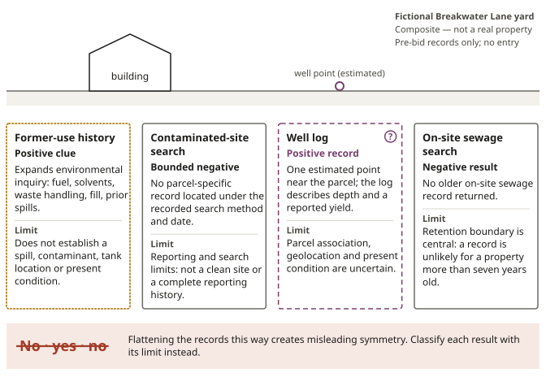
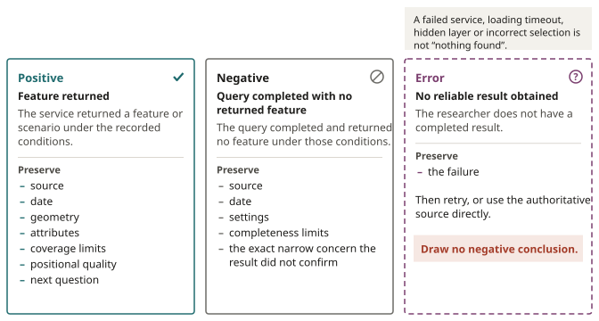

# Physical and Environmental Records

::: {.chain links="context,unknowns"}
Research chain: notice → parcel → **context** → **unknowns** → handoff. This chapter reads the
physical and environmental context around a parcel and records what remains unknown.
:::

::: {.objectives}
1. Turn exterior clues into literal observations.
2. Explain what the Environmental Registry, the provincial well database and the on-site sewage
   record service can and cannot show, including why a sewage record is unlikely for a property
   more than seven years old.
3. Read a coastal hazard scenario and an abandoned-mine inventory point with their stated limits.
4. Distinguish positive, negative and error results and write the note each one requires.
:::

::: {.keyterms}
- contaminated site
- well log
- hazard map
:::

## Three records beneath one yard {#sec-07-three-records}

### What the map supplies

::: {.case name="Breakwater Lane"}
Composite case — not a real property.

The fictional Breakwater Lane parcel faces a sheltered Nova Scotia cove. A low wooden building sits
back from the road. Faded lettering on an old photograph suggests that it once served as a small
engine-repair workshop. A more recent roadside image shows new siding and grass where a fuel tank
may once have stood.

The map supplies an exact parcel for research, a coastal setting, and a few resource layers.
:::

The map cannot smell heating oil in soil, test water, locate a buried pipe, or tell whether an old
system still works. [Figure 7.1](#fig-07-case-a-screening) shows the kind of screening layers such a
map can add, and what each kind of result means.

![**Case A: screening starts harder questions.** A screening map is not an environmental opinion. The fictional Parcel A (a composite, not a real property) with wet-ground, coastal, geology and mine-opening screening layers: searched layers keep their coverage, date and category limits visible, a mapped point or overlap starts another records question, and no mapped overlap is not a clean bill of health. Case A, plate 5: the screening layers used for the Breakwater Lane discussion; it is not a map of Breakwater Lane. Redrawn from figure-17 of the 2026 edition.](../assets/figures/fig-07-case-a-screening.svg){#fig-07-case-a-screening alt="Aerial-style map of Parcel A with wet-ground, coastal, geology and mine-opening screening layers and an unresolved-evidence legend. A geology ring is drawn as a searched layer, a wet-ground ring and a coastal band as screening clues, and a mine-opening ring as unresolved evidence. Searched layers: coverage, date and category limits stay visible. Screening clue: a mapped point or overlap starts another records question. No result: no mapped overlap is not a clean bill of health."}

### Keep the observation literal

The exterior clues are useful. The former workshop raises questions about:

- fuel;
- solvents;
- waste handling;
- fill;
- prior spills.

A pipe or concrete pad visible from a public place sharpens one of those questions. The date and
source of the image matter.

The observation should remain literal: a feature is visible, or a historical record describes a
use. "Contamination" is not an exterior observation.

### Contaminated sites and the Environmental Registry

A **contaminated site** is land or water affected by a contaminant in a way that engages
environmental assessment, management, or remediation questions. The precise legal and technical
meaning belongs to the governing framework and qualified professionals. For a pre-bid researcher,
the term names a condition that records and history may flag but a roadside view cannot diagnose.

Nova Scotia's Environmental Registry and contaminated-sites information can add evidence. A
returned approval, report, spill-related file, or site record may identify an activity, date,
location, responsible process, or document worth reviewing.

Each returned item has to be matched to the parcel and question, allowing for:

- similar civic descriptions;
- estimated positions;
- changing parcel boundaries;
- neighbouring activities.

An empty search has a smaller job. It establishes that the researcher did not find a responsive
record within the chosen source, terms, date, and search method. It does not establish that:

- no release occurred;
- no contaminant exists;
- every historic activity was reported;
- the parcel is clean.

::: {.rail label="A way to picture it"}
A registry is a collection of records created under its own rules and history. It is not a soil
sample spread across the province.
:::

::: {.case name="Breakwater Lane"}
Composite case — not a real property.

Breakwater Lane therefore receives two entries in the file.

::: {.filenote case="Breakwater Lane · former use"}
**Observation:** Historical-use clue: dated photograph appears to show an engine-repair use.
Current exterior context: a small building and a possible former tank area are visible from public
imagery.

**Limitation:** These observations do not establish a spill, contaminant, tank location, or
present condition.
:::

::: {.filenote case="Breakwater Lane · registry search"}
**Observation:** Registry search: no parcel-specific contaminated-site record located under the
recorded search method and date.

**Limitation:** The negative search does not establish a clean site or complete reporting history.

**Next authority:** Next question: expand the address, parcel-history, neighbouring-site, and
prior-use search, then ask an environmental professional what lawful pre-purchase assessment is
warranted.
:::
:::

[Figure 7.2](#fig-07-case-b-screening) shows the same discipline on a second fictional plate: a
mapped former use and a nearby registry point each lead to a question, not a finding.

{#fig-07-case-b-screening alt="Parcel B map with a former-use symbol, nearby registry point and arrows to records and environmental-professional questions. Searched layers: coverage, date and category limits stay visible. Screening clue: a mapped point or overlap starts another records question. No result: no mapped overlap is not a clean bill of health."}

### Wells and well logs

The second infrastructure question is water. The provincial well database contains records that
can include location, geology, construction, depth, and yield information. With many decades of
drilling history gathered into one system, it can reveal patterns and individual records that would
otherwise be hard to find.

A **well log** is the recorded account of a well's construction and drilling details. It
describes how deep the driller went, the materials encountered, the casing, and a reported yield.
Those fields help a professional understand regional conditions or investigate whether a record
relates to the property.

The map point is not the well. Its position may be based on the location information available when
the record was collected, and the Province warns that the database may be incomplete or inaccurate.

A log also records a drilling event. It is not a guarantee of:

- current equipment;
- current yield;
- potable water;
- legal compliance;
- the condition of whatever exists on site today.

::: {.case name="Breakwater Lane"}
Composite case — not a real property.

Breakwater Lane returns one well point near the graphical parcel. The address resembles an older
address associated with the workshop, but the location is estimated and the parcel has since been
reconfigured. The log describes depth and a reported yield.

A weak file says, "The property has a well." A bounded file says:

::: {.filenote case="Breakwater Lane · well log"}
**Observation:** The provincial database returned one estimated well-log point near the selected
parcel under the recorded search. The log contains drilling and construction information.

**Unknown:** The current well location, parcel association, ownership, physical condition, yield,
water quality, and serviceability remain unverified.
:::
:::

The distinction survives even if the point falls inside the current graphical parcel. Containment
compares two mapped objects. It does not cure uncertainty in the source coordinates or prove that
the physical feature remains where the log suggests.

### On-site sewage records

The third question is sewage. In the fictional Breakwater Lane file, a provincial search returns no
old on-site sewage record for the property. That absence may feel like a warning that no approved
system exists, or reassurance that there was never a problem. It supports neither conclusion.

Nova Scotia's environmental record service warns that a record is unlikely for a property more than
seven years old. Its process information describes on-site sewage files as records with a limited
retention period.

The negative result is consistent with many realities:

- An older system may have been installed under records no longer retained.
- A system may have been changed, abandoned, shared, or never documented in the searched source.
- The address or parcel relationship may have changed.
- A file elsewhere may answer part of the question.

None of those possibilities should be selected merely because it would make the purchase easier to
imagine. The correct note is narrower:

::: {.filenote case="Breakwater Lane · sewage search"}
**Observation:** No older on-site sewage record was returned through the checked provincial request.

**Limitation:** The source's retention limits mean this negative result does not establish that no
system exists, that an existing system was approved, or that any system is suitable or functional
now.

**Next authority:** Current municipal and provincial requirements, available property history, and
qualified on-site assessment remain separate next steps.
:::

### Classify the results; do not count them

Three records now sit beneath one yard:

- The contaminated-site search returns no parcel-specific entry.
- The well database returns an estimated point and a detailed old log.
- The sewage search returns no old file in a system with a known retention limit.

"No," "yes," and "no" would flatten those results into misleading symmetry. The stronger summary
classifies them, as [Figure 7.3](#fig-07-three-records-one-yard) shows:

- The former-use history is a positive clue that expands environmental inquiry.
- The registry search is a bounded negative result with reporting and search limits.
- The well log is a positive record with uncertain parcel association, geolocation, and
  present-condition limits.
- The sewage search is a negative result whose retention boundary is central to its meaning.

{#fig-07-three-records-one-yard alt="Four records under one fictional yard. The former workshop use is a positive clue that widens environmental questions about fuel, solvents, waste handling, fill and prior spills; it does not establish a spill, contaminant, tank location or present condition. The contaminated-site search found no parcel-specific record under the recorded search method and date, within its search and reporting limits; it is not a clean site or a complete reporting history. One estimated well-log point near the parcel describes depth and a reported yield, but its parcel association, location and present condition are uncertain. The sewage search found no older record, a negative result whose retention boundary is central to its meaning: the record service warns that a record is unlikely for a property more than seven years old. Reading these as no, yes, no would mislead."}

[Figure 7.4](#fig-07-case-b-orientation) opens a second fictional case plate, Parcel B, where an
occupied-looking building changes the question set. Chapter 8 returns to that occupied-building
case.

{#fig-07-case-b-orientation alt="Map locating fictional Parcel B in a serviced community with a building footprint and nearby streets. Place: locate fictional Case B among roads, communities and water. Limit: orientation does not prove access, title, condition or services."}

### No entry

::: careful
None of this authorizes a visit. A municipal tax-sale listing does not grant entry, and an exterior
research file cannot be converted into a private-site inspection.
:::

If sufficient lawful investigation cannot occur before bidding, the remaining physical uncertainty
belongs in the decision as uncertainty. It does not disappear because the auction date arrives.
[Figure 7.5](#fig-07-case-b-access) shows what exterior observation from public places can and
cannot add.

{#fig-07-case-b-access alt="Street-and-terrain map of Parcel B showing a driveway, drainage path and public observation points outside the parcel boundary. A dotted visible track runs from the street to the building and is marked with a question. Visible approach: a road or track on a map is a screening clue. Legal access: registry and legal review must answer the right-of-way question. Terrain: contours and drainage change site questions, not legal rights."}

### What the records accomplished

The records have improved the file. They have separated:

- a former-use clue from a contamination conclusion;
- a drilling record from a current water system;
- a missing sewage file from a compliance finding.

Each source now produces a specific next question. That is what pre-bid environmental research can
accomplish. It can illuminate part of the yard. It cannot make the unseen ground testify.

::: source
Nova Scotia Environment and Climate Change, Environmental Registry, Contaminated Sites,
Environmental Records Management System and Environmental Registry process information (source
no. 20, refreshed July 20, 2026): registry and contaminated-sites records, and the boundary that
absence from an online search is not proof of clean soil, water or buildings (evidence note
ENV-001); on-site sewage records are unlikely for a property more than seven years old and are kept
for a limited retention period (ENV-003). Nova Scotia, Well Logs Database and Private Wells in Real
Estate Transactions (no. 21, refreshed July 20, 2026): well-log contents, estimated positions and
the Province's disclaimer of completeness and accuracy (ENV-002). Cape Breton Regional
Municipality, Tax Sales page and FAQ (no. 7, refreshed July 20, 2026): the municipality cannot
authorize a bidder to enter; pre-sale observation stays on public land or other places where the
researcher has permission (LAND-007).
:::

## A future shore and an incomplete past {#sec-07-shore-and-past}

The fictional Breakwater Lane's biography now moves in two directions. The coastal record looks
forward into changing water levels and storms. The geological record looks backward into mining
activity that may be poorly documented or imprecisely located. Both can change the next question
without delivering a property verdict.

### Hazard maps

A **hazard map** is a screening map that depicts a defined hazard or scenario using stated data and
methods. The definition is intentionally tied to the source. A hazard map does not mean that damage
will occur at every coloured place or that an uncoloured place is safe from every related hazard.

A parcel inspector makes that boundary easier to retain by reporting three things separately:

- study coverage;
- scenario;
- returned intersection.

It cannot turn "outside this study extent" into "no risk," or a no-pixel result into a finding
about the whole property.

### The Coastal Hazard Map

Nova Scotia's Coastal Hazard Map lets a researcher search by community, address, or PID and examine
current, 2050, and 2100 scenarios. Its 2100 worst-case coastal flooding scenario combines:

- the highest high tide;
- a one-in-one-hundred-year storm surge;
- projected sea-level rise.

That is a powerful planning view because it makes a future combination visible across a large area.

The displayed colour has a specific meaning. It belongs to the selected scenario, current data,
model, resolution, and map guidance. [Figure 7.6](#fig-07-coastal-scenario) sets out what the colour
does and does not report.

| The colour does not report | It is not |
|---|---|
| the elevation of a surveyed building floor | an engineering design |
| the condition of a shoreline protection structure | an insurance decision |
| the route floodwater would take through a culvert | a municipal development approval |
| the damage a particular storm will cause | |

{#fig-07-coastal-scenario alt="How to read a coastal hazard scenario. The 2100 worst case combines the highest high tide, a one-in-one-hundred-year storm surge and projected sea-level rise; current and 2050 are other scenarios, not added probabilities. The colour belongs to the selected scenario, current data, model, resolution and map guidance. It does not report a surveyed building floor's elevation, a shoreline protection structure's condition, the route floodwater would take through a culvert, or the damage a particular storm will cause, and it is not an engineering design, an insurance decision or a municipal development approval. A one-percent or five-percent annual-exceedance probability on a published river-study layer describes the event mapped by that study."}

::: {.case name="Breakwater Lane"}
Composite case — not a real property.

Suppose the 2100 scenario shades part of Breakwater Lane's graphical parcel. The file should not
say, "The property will flood." It says:

::: {.filenote case="Breakwater Lane · coastal scenario"}
**Observation:** The checked Coastal Hazard Map shows scenario coverage overlapping part of the
current graphical parcel under the selected 2100 setting.

**Limitation:** The result is a long-range screening observation, not a surveyed boundary, site
elevation, event prediction, engineering conclusion, insurance determination, or permit decision.

**Next authority:** Next questions include the exact scenario definition, current topographic and
site evidence, intended building location, access route, and advice from the appropriate planning
and technical professionals.
:::

Now move the coloured area just outside the parcel line. The proximity still justifies questions
about the road, drainage, neighbouring ground, emergency route, and uncertainty in the screening
geometry. It cannot be silently changed into either "affected" or "safe."
:::

### Abandoned mine openings

The mine record requires a different kind of care. Nova Scotia's Abandoned Mine Openings inventory
is a valuable record of known openings and related information. Its own description sets three
limits:

- The inventory is incomplete: undocumented openings exist.
- The product does not include surface expressions of subsidence.
- Site conditions may change.

The metadata adds a location boundary that matters at parcel scale. In the 2024 version, positions
on private land can have lower confidence and may be inaccurate by roughly 50 metres. That distance
can cross a road, parcel line, building site, or shoreline on a rural map, as
[Figure 7.7](#fig-07-positional-uncertainty) shows. Repeating a point coordinate without its
positional quality would make the number sound more exact than the record.

{#fig-07-positional-uncertainty alt="A mine opening symbol sits just outside a fictional parcel. A circle with a radius of roughly 50 metres shows how far the true position may be from the symbol on private land in the 2024 inventory, enough to cross the parcel line and the road. The inventory is also incomplete, undocumented openings exist, it leaves out surface expressions of subsidence, and site conditions may change."}

::: {.case name="Breakwater Lane"}
Composite case — not a real property.

Imagine that the mine layer returns a known opening point just outside Breakwater Lane. The returned
record supports the existence of an inventory entry with a stated approximate position and
attributes. It creates questions about the documented working, positional uncertainty, surrounding
geology, surface evidence, and qualified site assessment.

It does not prove:

- that an opening lies at the symbol;
- that workings stop at a parcel line;
- that the property is unsafe.
:::

An empty query is more delicate. "No abandoned mine opening shown" means the checked source returned
no displayed opening under the recorded query and map state. Because the inventory is incomplete and
excludes some expressions of hazard, the result cannot support "no mining hazard." It may still
reduce one specific concern: no known inventory point was returned by that search. That is useful
evidence when its boundary stays attached.

### What a beam covers

::: {.rail label="A way to picture it"}
The relationship resembles a flashlight in a dark barn. The beam is the source's coverage. It can
reveal a post, a stair, or clear floor in the area it illuminates. Darkness outside the beam does
not prove the barn is empty.

The analogy has a limit. A public database has systematic scope, methods, and evidence; its beam is
not random, and different sources are not equally weak. The point is to learn what this beam covers
before making a claim about what it did not show.
:::

[Figure 7.8](#fig-07-negative-search-beam) turns the beam into four coverage questions to ask of any
empty result.

{#fig-07-negative-search-beam alt="A flashlight beam covers part of a dark field labelled by time, location and record type; hazards outside the beam remain unknown. Time: was the relevant period included? Place: was the parcel inside the source's mapped coverage? Record type: would this source contain the event or condition? Match rule: could spelling, geometry or identifiers hide a record?"}

### Positive, negative and error

This is why the interface must keep positive, negative, and error states apart:

- A **positive** state means the service returned a feature or scenario under the recorded
  conditions.
- A **negative** state means the query completed and returned no feature under those conditions.
- An **error** state means the researcher does not have a completed result.

A failed service, loading timeout, hidden layer, or incorrect selection cannot be narrated as
"nothing found."

The three states produce different notes:

| State | The note |
|---|---|
| Positive: feature returned. | Preserve source, date, geometry, attributes, coverage limits, positional quality, and next question. |
| Negative: query completed with no returned feature. | Preserve source, date, settings, completeness limits, and the exact narrow concern the result did not confirm. |
| Error: no reliable result obtained. | Preserve the failure and retry or use the authoritative source directly. Draw no negative conclusion. |

{#fig-07-result-states alt="Three result states. Positive: a feature was returned; keep its source, date, geometry, attributes, coverage limits, positional quality and the next question. Negative: the query finished and returned nothing; keep the source, date, settings and completeness limits, and name the exact narrow concern it did not confirm. Error: no reliable result; record the failure, retry or go to the authoritative source directly, and draw no negative conclusion. A failed service, loading timeout, hidden layer or incorrect selection is not nothing found."}

::: {.recall}
The memorable picture of the fictional Breakwater Lane is blue coastal shading near an old workshop.
The questions that rebuild the file are smaller and safer:

1. Which scenario was selected?
2. What did its guidance say the colour represented?
3. Did the mine query return a feature, return none, or fail?
4. What limitation travels with each result?
5. Which property-specific question comes next?
:::

### The environmental summary

::: {.case name="Breakwater Lane"}
Composite case — not a real property.

The file now holds a coherent environmental summary:

::: {.filenote case="Breakwater Lane · environmental summary"}
**Observation:** A former workshop use raises a prior-activity question. No parcel-specific
contaminated-site record was located under the recorded search, which does not establish
cleanliness. One estimated well-log point requires parcel and present-condition confirmation. No
older sewage file was returned from a source with a limited retention history. Coastal scenario
mapping overlaps part of the graphical parcel under the selected setting. The abandoned-mine query
result is recorded separately with the inventory's completeness and positional limits.

**Limitation:** None of these records replaces lawful inspection, sampling, surveying, engineering,
planning, insurance, or legal advice.
:::

That paragraph tells the research team what the evidence can presently carry.
:::

The uncertainty may govern the bid decision in any of three situations:

- the intended use cannot tolerate the remaining risk;
- lawful investigation is unavailable;
- the required professional questions cannot be answered before the deadline.

A source limitation is not a reason to throw the source away. It is the edge of the source's useful
claim:

- The Coastal Hazard Map can reveal a scenario that deserves attention.
- The abandoned-mine inventory can reveal a documented feature or the absence of one returned by the
  checked query.
- Well and environmental records can reconstruct parts of a property's physical history.

The mistake is asking any one beam to illuminate the entire parcel.

Breakwater Lane remains unseen in important ways. That is not a failure of careful research.
Careful research has made the unseen parts specific enough to route, investigate, price, or
refuse. The map becomes safer as soon as its silence is no longer mistaken for reassurance.

::: source
Nova Scotia, Coastal Hazard Map User Guide (source no. 22, refreshed July 20, 2026): search by
community, address or PID; current, 2050 and 2100 scenarios; the 2100 worst-case coastal flooding
scenario's three components; a planning clue rather than a parcel-specific engineering, insurance
or development conclusion (evidence note ENV-004). Nova Scotia Natural Resources, Abandoned Mine
Openings Database description, Version 9 download and 2024 metadata (no. 23, refreshed July 20,
2026; Nova Scotia Open Government Licence): the inventory is incomplete and excludes surface
expressions of subsidence; evidence note ENV-005 records the 2024 Version 9 metadata as saying that
private-land opening positions "can be inaccurate by up to approximately 50 metres". This chapter
keeps the 2026 edition's wording, "roughly 50 metres".
:::

::: {.summary}
- Keep exterior observations literal: a feature is visible, or a historical record describes a use.
  "Contamination" is not an exterior observation.
- A returned Environmental Registry or contaminated-sites record must be matched to the parcel
  and question. An empty search establishes only that no responsive record was found within
  the chosen source, terms, date and search method.
- A well-log map point is not the well. Its position may be estimated, the database may be
  incomplete or inaccurate, and a log records a drilling event, not current equipment, yield,
  potable water, compliance or condition.
- A missing on-site sewage record supports neither "no approved system" nor "never a problem": the
  record service warns that a record is unlikely for a property more than seven years old.
- Classify results instead of counting them: "no, yes, no" flattens a bounded negative, a positive
  record with uncertain association and a retention-limited negative into misleading symmetry.
- A municipal tax-sale listing does not grant entry. Uncertainty that lawful investigation cannot
  reach before bidding belongs in the decision as uncertainty.
- A coastal hazard colour belongs to the selected scenario, current data, model, resolution and map
  guidance; it is not an engineering design, insurance decision or municipal development approval.
- The Abandoned Mine Openings inventory is incomplete, excludes surface expressions of subsidence,
  and in its 2024 version private-land positions can have lower confidence and may be inaccurate by
  roughly 50 metres. Keep positive, negative and error results apart, each with its own note.
:::

::: {.check}
1. A roadside image of the fictional Breakwater Lane shows new siding and grass where a fuel tank may
   once have stood. Write the observation in literal terms, and say what it does not establish.
   [Answer](#ans-07-1)
2. A contaminated-site search returns no parcel-specific record. What does that result establish,
   and name four things it does not establish. [Answer](#ans-07-2)
3. The well point for Breakwater Lane falls inside the current graphical parcel. Does that confirm
   the parcel has a well? Explain why or why not. [Answer](#ans-07-3)
4. No older on-site sewage record is returned. Why does that result support neither a warning nor
   reassurance, and what remain the next steps? [Answer](#ans-07-4)
5. The 2100 Coastal Hazard Map scenario shades part of a parcel, and the mine layer returns no
   opening. Write one sentence for each result that keeps its limit attached. [Answer](#ans-07-5)
6. A map layer fails to load during a search. Which result state is this, what should the note
   preserve, and what conclusion may be drawn? [Answer](#ans-07-6)
:::
