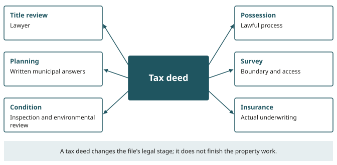

# After the Deed

::: {.chain links="handoff"}
Research chain: notice → parcel → context → unknowns → **handoff**. After the deed, the file is
handed to the people who answer title, possession, planning, survey, condition, insurance and tax
questions, and the surplus and challenge questions go down their own legal routes.
:::

::: {.objectives}
1. Describe the two routes to a deed request and what to check in the delivered deed.
2. Explain deed registration, the Affidavit of Value and registry fees as dated requirements.
3. Distinguish the six-month, six-year and 20-year clocks and what starts each.
4. Plan a second due-diligence wave without treating any one answer as the whole project.
5. Keep the ownership, surplus and challenge files separate.
:::

::: {.keyterms}
- deed registration
- post-deed due diligence
- tax-sale surplus account
:::

## The document changes, the questions move {#sec-12-document}

### Back to Foundry Street, in sequence

Chapter 8 deliberately flashed forward to the fictional Foundry Street property after its tax deed
had been registered, so that title and possession could be separated before bidding economics
began. This chapter enters that branch in sequence.

::: {.case name="Foundry Street"}
Composite case — not a real property.

The sale of Foundry Street has not been redeemed, the applicable wait has ended, and the
certificate holder asks the municipality for the deed.
:::

### Two routes to the deed request

Nova Scotia's Municipal Government Act supplies two routes to that request:

- **Older arrears.** If the taxes were already unpaid for more than six years when the sale
  occurred, the purchaser may request the deed after the sale.
- **Redeemable property.** For a redeemable property that remains unredeemed, the request comes
  after six months.

In either route, the purchaser pays the fee set by council, and the municipality delivers the
prescribed deed to the purchaser or as the purchaser directs.

This is a request-and-document step. The page does not turn automatically on the sixth-month
anniversary.

::: {.case name="Foundry Street · requesting the deed"}
Composite case — not a real property.

Foundry Street's file:

1. confirms that the redemption period has actually expired without redemption;
2. obtains the municipality's current instructions;
3. pays the applicable fee;
4. checks the delivered deed.

The review of the deed covers the land description, grantee, signatures, municipal seal, related
sale record and any direction given by the purchaser.
:::

The deed has the statutory title effect explained in Chapter 8. The new problem is what the owner
does with the document and which systems begin to depend on it.

### Registration, the Affidavit of Value and fees

**Deed registration** is the entry of the deed into Nova Scotia's land-record system. It gives the
file a recorded instrument and a registration date that can be searched and related to the correct
parcel. The purchaser handles registration through the current Land Registry requirements and
property-specific legal advice, and does not assume that the municipality has completed every
downstream filing.

As of July 2026, the provincial deed-transfer service says an Affidavit of Value is required when
real property is transferred, even when no municipal deed transfer tax is payable. The Municipal
Government Act separately exempts a deed given through a tax sale from municipal deed transfer tax.
The two statements fit together: the tax exemption does not erase the required registration
information.

The exemption also does not answer every tax question. The separate provincial non-resident deed
transfer tax and the transaction-specific HST branch from Chapter 9 remain property- and
purchaser-specific. Foundry Street's lawyer and tax adviser apply the current rules to the actual
transfer rather than turning one municipal exemption into the word "tax-free."

Current Land Registry guidance (July 2026) also lists fees due when a document is registered,
recorded or filed. Those amounts can change. The durable entry in the ownership file is:

- the current official fee;
- the payment receipt;
- the submitted documents;
- the registration particulars;
- the lawyer's confirmation.

### Registration starts another clock

Under the Marketable Titles Act, a tax deed generally may be set aside only during the six years
following its registration. After that period, the section gives the deed strong binding and
conclusive effect, subject to:

- its specific land-exclusion conditions;
- the current-owner fraud or breach-of-trust exception;
- the preserved possibility of a damages claim for wrongful tax sale.

The start date is the deed-registration date. It is not auction day, the end of redemption, deed
delivery or the day somebody first enters the building. The earlier six-month redemption period and
this six-year period measure different legal questions ([Figure 12.1](#fig-12-three-clocks)).

{#fig-12-three-clocks alt="Three different legal clocks. The six-month redemption period and the twenty-year limit on applying for surplus proceeds are both counted from the sale date. If taxes were unpaid for more than six years when the sale occurred, there is no six-month redemption period and the purchaser may request the deed after the sale. A person claiming an interest may apply to the Supreme Court for surplus after the redemption period and before twenty years have passed from the sale. The six-year period in which a tax deed can generally be set aside runs from the deed's registration date, not auction day, the end of redemption, deed delivery or first entry. After it, the deed has strong binding and conclusive effect, subject to a land-exclusion rule, a fraud or breach-of-trust exception, and a preserved claim for damages."}

::: careful
Six years is not a title-review waiting strategy. The purchaser needs the deed, parcel register,
legal description, relevant instruments, sale record and legal opinion when ownership decisions
begin. A claimed defect, excluded land, fraud allegation, boundary problem or other dispute cannot
be diagnosed from the clock alone. The statute sets a general timing rule and exceptions; counsel
handles the actual facts and remedies.
:::

### Rights-of-way and access, revisited

::: {.case name="Foundry Street · the right-of-way"}
Composite case — not a real property.

Foundry Street's registered right-of-way returns here with a practical job. The tax deed has been
recorded, but the relationship serving the house behind it continues under the statutory rule
described in Chapter 8. The new owner needs the source instrument and a clear understanding of
route, purpose, maintenance and permitted use before placing materials, fencing or equipment where
another parcel may have passage rights.
:::

The inverse access question also remains available. A visible driveway or mapped road beside a newly
deeded parcel does not establish legal frontage, a public-road connection or a registered right to
pass. The deed does not convert the imagery into a survey or repair a missing access instrument.

The title file therefore has a modest, exact centre: the registered deed for the correct PID and the
lawyer's interpretation of the current record. Around that centre sit:

- continuing easements or rights-of-way;
- any court order;
- boundaries;
- registration requirements;
- unresolved property-specific qualifications.

### Insurance changes stage

Insurance changes stage as well. A policy or binder written for a certificate holder during
redemption may have terms tied to that conditional interest, occupancy and known condition.
Foundry Street's new owner gives the insurer and broker the registered-deed information and any
updated possession or building facts. Whether coverage continues, changes or must be replaced comes
from the actual policy and underwriting response.

### Possession and first entry

Possession does not arrive through registration. Foundry Street was visibly occupied when Chapter 8
last examined it.

::: careful
As of July 2026, CBRM says it does not remove residents or provide access. Foundry Street's actual
municipality requires its own current-source check. The recorded deed does not identify the
legal status of the people inside. The owner continues through counsel and the lawful process
supported by the real facts. No lock, utility, rent demand or belongings decision is improvised from
the registration receipt.
:::

When lawful possession or authorized access is eventually established, the first entry is planned as
an unknown-condition event. Insurance terms, occupant rights, contractor authority, building safety
and environmental concerns are checked before anyone treats the premises as an ordinary renovation
site. A tax deed is a powerful title document, but it does not make an unstable stair, exposed
wiring, fuel leak or stored chemical safe to approach.

### Three records that should never be collapsed

The owner now holds three records:

| Record | What it does |
|---|---|
| Registered deed | States the land interest and supplies the date that starts the Marketable Titles Act period |
| Title opinion | Explains the actual deed and land record |
| Possession file | Establishes who is present and which lawful route governs access and control |

{#fig-12-deed-is-a-beginning alt="Tax deed at the centre sends six arrows to lawyer, possession, planning, survey, condition and insurance workstreams. Title review: lawyer. Possession: lawful process. Planning: written municipal answers. Survey: boundary and access. Condition: inspection and environmental review. Insurance: actual underwriting."}

Foundry Street can move into physical due diligence only when those files support the move
([Figure 12.2](#fig-12-deed-is-a-beginning)). Registration has changed the document, started a clock
and made the new owner responsible for decisions that the auction map could never make.

::: source
Municipal Government Act, consolidated to April 9, 2026 (source no. 1; refreshed July 20,
2026): deed request after the applicable wait, payment of the fee and deed effect, ss. 155–156
(evidence note LAW-012); six-month redemption and the older-arrears exception, ss. 152(1) and 155
(LAW-009); exemption of a tax-sale deed from municipal deed transfer tax, s. 109(4) (TAX-001).
Halifax Regional Municipality Charter (no. 2): ss. 167(1), 170–171. Nova Scotia, Municipal deed
transfer and property tax (no. 26; refreshed July 20, 2026): the Affidavit of Value (TAX-001).
Nova Scotia, Land Registry fees (no. 18; refreshed July 20, 2026): fees due at registration,
recording or filing; amounts are perishable. Marketable Titles Act, consolidation dated
September 1, 2015 (no. 3; refreshed July 20, 2026): the six-year period and its qualifications,
s. 6(2)–(6) (LAW-018). CBRM, Tax Sales page (no. 7; refreshed July 20, 2026): no removal of
residents and no access (OCC-001). Non-resident deed transfer tax and HST: see Chapter 9 (nos. 27,
28; TAX-002, TAX-003). The fee "set by council", the "prescribed deed" and delivery "as the
purchaser directs" are not itemized in the evidence notes.
:::

## The second due-diligence wave {#sec-12-second-wave}

### What changes after the deed

The first due-diligence wave helped decide whether to bid. It worked from a distance, under the sale
conditions, while ownership and lawful access were unresolved. The deed creates an opportunity for
better evidence, but only after lawful possession or authorized entry makes that evidence
obtainable.

**Post-deed due diligence** is the deliberate reopening of the intended-use, condition, cost and
permission files after ownership has changed and better evidence becomes lawfully available.

::: {.case name="Foundry Street · the pre-bid plan"}
Composite case — not a real property.

Foundry Street's pre-bid plan was modest: stabilize the occupied building, understand the
right-of-way and, if the evidence supported it, prepare a small rental rehabilitation. That plan was
conditional. It did not become an obligation when the deed was registered.
:::

The post-deed file begins with the intended use stated again in plain language. "Rental
rehabilitation" has consequences for occupancy, fire safety, building work, insurance, services,
financing and local land-use rules. A plan that was acceptable under rough screening numbers may
fail once those systems return real costs or restrictions.

### Municipal letters

Municipal letters sharpen part of the picture. As of July 2026, Cape Breton Regional
Municipality, for example, distinguishes two products:

- A **zoning-confirmation letter** confirms the zoning and applicable provisions identified by
  municipal planning staff.
- A **municipal-clearance letter** reports specified outstanding building-code, by-law or fire-code
  violations in municipal records.

Neither letter is a universal property approval. A zoning confirmation does not promise that a
proposed design will receive permits. A clearance response does not replace an inspection and
cannot reveal a defect that was never reported or recorded. The owner asks for the current product
that matches the actual question, retains the response date and qualifications, and sends any
difficult answer to the appropriate municipal staff or professional.

### Public assessment information

Public assessment information supplies another source. Property Valuation Services
Corporation (PVSC) allows the public to find assessments by civic address or Assessment Account
Number and offers broader searches, including by assessment range. Its open assessment-history data
shows assessed and taxable assessed values over several years.

A selected parcel sheet may carry that dated PVSC account and assessment beside other public
evidence.

Those values need labels:

- The assessed value is a dated mass-appraisal estimate based on a stated valuation date and the
  physical state recorded for a stated condition date.
- The **taxable assessed value** may differ, including through the **Capped Assessment Program**.
  Transfer-related eligibility can also change.

The numbers are useful context for the assessment and tax files. They are not a current appraisal,
a repair estimate, a resale promise or the maximum rational bid.

::: {.rail label="In practice"}
Foundry Street therefore records the assessment year, value type and source beside the number. Its
owner does not call the number "property value" in the project budget. The tax adviser and
municipality handle the actual taxable assessment and rates, while current market and condition
decisions use evidence suited to those jobs.
:::

### Lawful access and professional findings

Lawful physical access can now replace several pre-bid unknowns with qualified observations:

- A building professional may find that the roof requires more than the temporary protection
  imagined during redemption.
- Electrical, structural, fire or moisture evidence may change the work sequence.
- Service providers can confirm whether a connection exists, whether it functions and what
  restoration would require.
- An insurer can underwrite the actual occupancy and condition rather than the map impression.

Each answer is narrower than the whole project. The file gains strength when each source is
allowed to answer its own question:

| This answer | Does not supply |
|---|---|
| A building inspection | A title opinion |
| A service connection | Proof of planning permission |
| A survey | Certification of environmental condition |
| An insurer's offer | Lawfulness of the proposed use |

### Environmental evidence and source layers

Environmental evidence follows the same rule. Provincial guidance explains that contamination can
affect soil, water and air. A map layer, historic image or neighbouring land use can justify a
question; it cannot diagnose the parcel. The owner gives the site's actual history, observed
materials and proposed work to a qualified environmental professional and follows the
property-specific regulatory route that results.

The same restraint applies to wells, on-site sewage, coastlines, flood context, mine workings and the
other source layers introduced earlier. Their map symbols are retrieval handles. After the deed, the
owner returns to the current official record, obtains inspection or professional interpretation
where needed, and records what is still unknown.

Foundry Street's right-of-way and access questions also receive a second pass. The lawyer interprets
the registered instruments. A surveyor relates the legal description and visible occupation to
the ground. The owner then plans work around the actual rights and boundaries rather than around a
line seen on an orientation map.

### When the evidence changes the plan

::: {.case name="Foundry Street · the economics change"}
Composite case — not a real property.

Suppose the combined evidence changes the rehabilitation economics:

- the clearance file identifies an unresolved order;
- the building review expands the immediate stabilization scope;
- the insurer will cover only a tightly controlled vacant-building phase.

None of that proves the purchase was a mistake. It proves that the earlier screen has done its job:
it preserved room for better evidence to change the next decision.
:::

The project can be narrowed, delayed, stabilized for later work, prepared for a lawful resale, or
taken back to advisers for a different route. Ownership does not require loyalty to the pre-bid
story. It requires responsible treatment of the land, the people connected to it and the evidence now
available.

The second due-diligence wave ends with an updated decision record. It states:

- the intended use;
- the evidence dates;
- the material unknowns;
- the required professional or municipal handoffs;
- the next authorized expenditure.

That record is more useful than a victory photograph, because it shows what the deed has made
possible and what it has not solved.

::: source
CBRM, Zoning Confirmation and Municipal Clearance (source no. 25; refreshed July 20, 2026): the
zoning letter and the clearance letter, neither a permit or physical inspection (evidence note
LAND-006). Property Valuation Services Corporation, Find an Assessment, 2026 assessment-notice
guidance and datazONE assessed-value history (no. 17; refreshed July 20, 2026): search options and
assessed versus taxable assessed values (LAND-003). The Capped Assessment Program and
transfer-related eligibility are not named in the evidence notes or the source register. Nova
Scotia Environment and Climate Change, Environmental Registry and Contaminated Sites (no. 20;
refreshed July 20, 2026): contamination of soil, water and air (ENV-001). Wells, on-site sewage,
coastal and mine layers: see Chapter 7 (ENV-002 to ENV-005). Access and legal description: LAND-005.
:::

## The money and the challenge take different roads {#sec-12-money}

### Two things the deed does not do

The deed gives the purchaser an ownership route. It does not make every dollar from the sale belong
to the purchaser, and it does not eliminate the legal route for a person who claims the sale was
wrongful.

### The surplus account

A **tax-sale surplus account** is the municipality's statutory account for sale proceeds remaining
after the required municipal applications. It is a proceeds record, not a statement about which
interests continue to burden the land ([Figure 12.3](#fig-12-surplus-proceeds-route)).

{#fig-12-surplus-proceeds-route alt="Sale proceeds first satisfy statutory municipal amounts, then enter a surplus account; after redemption expiry a prior interest holder may apply to Supreme Court before the twenty-year endpoint. Purchase money, the amount received at the tax sale, goes first to statutory applications: taxes, interest, sale expenses and specified municipal amounts. The balance is held in the tax-sale surplus account. If the property is redeemed, the balance reduces the redemption amount under the statutory formula. No automatic payout, no purchaser windfall; the court route and deadlines matter."}

::: {.case name="Elena"}
Composite case — Elena is a fictional former co-owner, not a real person.

Elena's interest may have attached to the property before the sale. She discovers that the sale
produced a balance after the municipal applications.

She does not ask the new deed holder to pay her, and she does not treat the old interest as a
continuing lien on the land. She takes the notices, ownership documents and sale information to a
lawyer.
:::

The statute supplies a separate proceeds route. A person claiming an interest in land sold for taxes
may apply to the Supreme Court after the redemption period and before 20 years have passed from the
sale. The court may order proportional payment from the surplus account.

That description is a route, not a prediction about Elena's standing, evidence, share or result. The
sale date controls the 20-year period. Her lawyer identifies the correct parties, proof and court
procedure. The new owner's registration date controls the different six-year tax-deed period
discussed earlier. Writing both dates in one file prevents the word "deadline" from collapsing two
unrelated clocks ([Figure 12.1](#fig-12-three-clocks)).

### A challenge to the sale

A challenge to the sale travels on another track. A claimant may allege:

- that the sale included land that should not have been included;
- that a required step failed;
- that another statutory ground applies.

Those allegations cannot be resolved by comparing the map to the notice and declaring the deed safe
or void. They require the complete record and legal advice, and a court may be the decision-maker.

The Marketable Titles Act generally limits an action to set aside a tax deed to the six years
following registration. Its wording also preserves specific qualifications:

- The land-exclusion provision depends on statutory conditions concerning the assessment, the
  relevant interest and the arrears.
- A current owner who participated in fraud or breach of trust does not receive the general
  protection.
- The section preserves a cause of action for damages arising from a wrongful tax sale.

Those are legal branches, not screening shortcuts.

If a tax sale is set aside, the Municipal Government Act says the tax lien is not discharged. The
result is therefore not a simple rewind in which all prior positions vanish and the municipality's
claim disappears.

### Three files for one sale

The ownership, surplus and challenge files stay distinct even when they refer to the same
sale:

| File | What governs it |
|---|---|
| Ownership | The registered deed and title opinion support the owner's land decisions. |
| Surplus | The municipal accounting and court materials govern a claimant's possible share of surplus proceeds. |
| Challenge | The sale record, statute and legal process govern a claimed defect or remedy. |

Keeping the files separate prevents two opposite errors. The deed holder does not appropriate
surplus money that the statute reserves for another process. The former interest holder does not
assume that a possible proceeds claim grants present possession or control of the land.

::: {.case name="Foundry Street and Elena · where the files end"}
Composite cases — not real properties or people.

Foundry Street closes the chapter with a registered deed, an active title and possession file, and a
revised property plan based on evidence that was not available at auction. Elena's separate file
preserves the surplus route without turning it into a claim against the building itself. A
contested-sale file, if one appears, goes to counsel.
:::

### Why the deed is a beginning

The deed is a beginning because it changes the legal stage and the quality of evidence the owner can
obtain. It begins registration responsibilities, ordinary ownership decisions and a second
due-diligence wave. It also leaves lawful routes for other people whose claims concern proceeds or
the sale itself.

The whole method can now be retrieved from first notice to post-deed file. The final task is not to
memorize every branch. It is to recognize the current stage, open the right evidence record and know
when the map must hand the matter to a municipality, registry, surveyor, insurer, tax adviser,
environmental professional or lawyer.

::: source
Municipal Government Act (source no. 1; refreshed July 20, 2026): sale proceeds, the tax-sale
surplus account and applications for surplus, ss. 146–147 (evidence note LAW-014); a set-aside sale
does not discharge the tax lien, s. 133(4) (LAW-017). Halifax Regional Municipality Charter (no. 2):
ss. 161–162 and 147(4). The court named in LAW-014 is the Nova Scotia Supreme Court;
the application "after the redemption period" is kept as printed. Marketable Titles
Act, consolidation dated September 1, 2015 (no. 3; refreshed July 20, 2026): the six-year limit, the
land-exclusion rule, the fraud or breach-of-trust exception and the preserved damages claim,
s. 6(2)–(6) (LAW-018). Figure source line: MGA ss. 146–147; HRMC ss. 161–162. The surplus balance
reducing the redemption amount: see Chapter 11 (LAW-010).
:::

::: {.summary}
- The purchaser may request the deed after the sale if the taxes were unpaid for more than six years
  when the sale occurred, or after six months for a redeemable property that remains unredeemed. The
  purchaser pays the fee set by council and checks the delivered deed.
- Deed registration enters the deed into Nova Scotia's land-record system. As of July 2026, an
  Affidavit of Value is required even though a tax-sale deed is exempt from municipal deed transfer
  tax; registry fees can change, so the file keeps the current official fee and receipt.
- Under the Marketable Titles Act, a tax deed generally may be set aside only during the six years
  following its registration, subject to a land-exclusion rule, a fraud or breach-of-trust exception
  and a preserved damages claim. The six years start at registration, not at auction day, the end of
  redemption, deed delivery or first entry.
- Registration does not deliver possession, insurance, access or a survey. The registered deed, the
  title opinion and the possession file are three records that should never be collapsed.
- Post-deed due diligence reopens the intended-use, condition, cost and permission files once better
  evidence becomes lawfully available. Each answer (a zoning letter, a clearance letter, an
  assessment, an inspection, an insurer's offer) remains narrower than the whole project.
- The tax-sale surplus account holds proceeds left after the required municipal applications. A
  person claiming an interest may apply to the Supreme Court after the redemption period and before
  20 years have passed from the sale; the court may order proportional payment.
- If a tax sale is set aside, the tax lien is not discharged. The ownership, surplus and challenge
  files stay separate even when they refer to the same sale.
:::

::: {.check}
1. Name the two routes to a deed request under the Municipal Government Act, and list what the
   fictional Foundry Street file checks in the delivered deed. [Answer](#ans-12-1)
2. A tax-sale deed is exempt from municipal deed transfer tax. Why does that not make the transfer
   "tax-free", and what still has to accompany registration? [Answer](#ans-12-2)
3. Three clocks appear in this chapter. For each, say what starts it and how long it runs.
   [Answer](#ans-12-3)
4. After the deed, CBRM issues a zoning-confirmation letter and a clean municipal-clearance letter
   for a property. What can the owner conclude, and what can they not? [Answer](#ans-12-4)
5. The fictional Elena, a former co-owner, learns that the sale produced a surplus. What route does
   the statute give her, and why does she not ask the new deed holder to pay? [Answer](#ans-12-5)
:::
