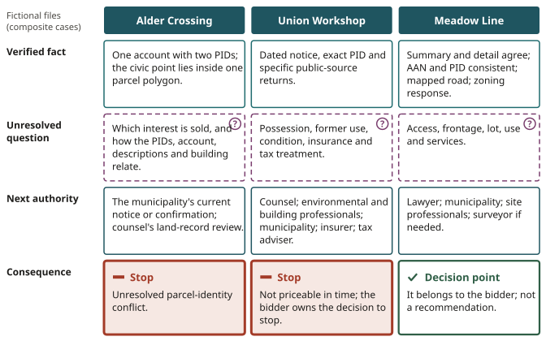
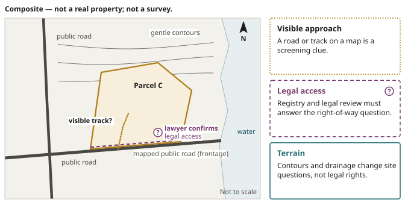

# Putting the Method Together

::: {.chain links="notice,parcel,context,unknowns,handoff"}
Research chain: **notice** → **parcel** → **context** → **unknowns** → **handoff**. This chapter
runs every link of the chain on three fresh files and shows that each one can end differently.
:::

::: {.objectives}
1. Run three fresh composite files through the method and state, for each, the verified fact, the
   unresolved question, the next authority and the decision consequence.
2. Explain why Alder Crossing stops, Union Workshop stays unresolved and Meadow Line reaches a
   decision point.
3. Keep a stage record that survives withdrawal, payment, redemption and deed.
4. Describe what a public map should and should not supply, and the separate roles of researcher,
   professionals and bidder.
:::

::: {.keyterms}
- civic point
- graphical boundary
- priceable uncertainty
- maximum bid
:::

## Three parcels, three different endings {#sec-13-three-endings}

At the beginning of this book, Harbour Road was a fictional row in a strong municipal packet. The
packet supplied facts, maps and registry material, but it could not decide what all of that
evidence meant for a bidder. Twelve chapters later, the useful test is whether the method works when
the facts change.

Three new fictional files arrive. None represents a live tax-sale property:

- One notice appears to involve two parcels, but its civic point lands in only one (Alder
  Crossing).
- One is an occupied building that may once have been a workshop (Union Workshop).
- One is vacant land whose records fit together better than the others (Meadow Line).

Every file begins the same way: dated notice, exact parcel, bounded context, unresolved questions
and the authority that can answer next. Their endings differ
([Figure 13.1](#fig-13-three-endings)).

{#fig-13-three-endings alt="Three fictional files, three endings. Alder Crossing stops because one account lists two PIDs and what interest the municipality intends to sell is unresolved. Union Workshop stays unresolved because its possession, former-use, condition, insurance and tax questions cannot be responsibly investigated before the event, and the bidder owns the decision to stop. Meadow Line's records agree and its remaining questions have credible routes, so it reaches a decision point, which belongs to the bidder."}

::: {.rail label="In practice"}
Before classifying any file, name four things in one sentence: the verified fact, the unresolved
question, the authority that can answer next and the decision consequence.
:::

### Alder Crossing: one account, two parcels

::: {.case name="Alder Crossing"}
Composite case — not a real property.

The first file is Alder Crossing. Its municipal row contains one account and two PIDs. Searching the
stated address returns an authoritative civic point inside the first parcel. The second PID selects
a separate adjoining shape. An aerial image makes the first parcel look like the obvious subject
because it contains a roof.
:::

Pause before classifying the file, and fill in the four parts:

| Part | Alder Crossing |
|---|---|
| Verified fact | The dated notice lists one account with two PIDs, and the returned civic point is contained in one of the two graphical parcel polygons. |
| Unresolved question | What interest the municipality intends to sell, and how the two PIDs, account, legal descriptions and any building relate. |
| Next authorities | The municipality's current notice or confirmation, and the governed land-record review interpreted by counsel. |
| Consequence | A stop: no parcel may be silently dropped from the file merely because the civic point and roof make one shape more memorable. |

The map has performed its job without solving the identity conflict. Civic-point containment found a
parcel to investigate; it did not rewrite a two-PID notice into a one-parcel sale. An AAN-to-assessment
route can add taxation context, but it cannot decide which registered interests are included. Until
the municipal record and land-record evidence reconcile the two PIDs, the file cannot support a title
request, use analysis or maximum bid.

Alder Crossing is a complete stop result. The researcher can state exactly what matched, what did
not, who owns the next answer and why attractive imagery does not choose the parcel.

### Union Workshop: an occupied building with a past

::: {.case name="Union Workshop"}
Composite case — not a real property.

The second file is Union Workshop. Its notice identifies an account and PID, and the aerial image
shows a substantial building. A street-level exterior view from a lawful public position suggests
that the premises are occupied. Older directories associate the address with repair work, while the
current public environmental search returns no matching contaminated-site notice for the exact
parcel.
:::

That collection of clues can sound reassuring or alarming, depending on which one a reader
overstates. The method allows neither reaction to become a fact. Each clue has a limit:

| Clue | What it cannot establish |
|---|---|
| The building image | It does not identify who is present, the person's legal status or whether vacant possession can be obtained. |
| The fictional notice | Nothing in Union Workshop's fictional notice supplies resident removal or entry. |
| The historical business reference | It does not diagnose contamination. |
| The negative registry search | It means only that this search found no matching record in that source. It does not certify the soil, water, air, building materials or contents. |

Where CBRM serves as the public comparison, its guidance expressly declines both resident removal
and entry; the real event still requires a current-source check.

The assessed-value record also stays in its lane. It records a dated mass-appraisal and taxation
context, including the assessment classification shown by the public source. It is not a current
appraisal of the occupied building, an inspection of the former use or a prediction of the auction
result.

Union Workshop now has two linked unknowns that cannot be collapsed:

- **Occupancy** belongs in a lawyer-reviewed possession and tenancy file.
- **Former use and current condition** belong in a property-specific environmental and building
  review.

Planning, fire and building officials can report the municipal records their systems cover. An
insurer can respond to the actual use, occupancy and condition evidence.

Tax treatment also needs its own route. If the event terms state that HST applies to vacant land or
commercially assessed property, that is an important instruction for that event. The actual federal
treatment still depends on the seller, property, use and transaction. The public assessment
classification is therefore a prompt for transaction-specific tax advice.

::: {.case name="Union Workshop · two days before the sale"}
Composite case — not a real property.

Suppose the sale is two days away. There is no lawful inspection opportunity, the occupancy status
is unresolved, and an environmental professional cannot review the former-use evidence in time.

The researcher does not invent reserves large enough to make the unknowns disappear. The file
records why they are not yet priceable and which facts would be required to reopen it.
:::

| Part | Union Workshop |
|---|---|
| Verified facts | The dated notice, exact PID and specific public-source returns. |
| Unresolved risks | Possession, former use, physical condition, insurance and tax treatment. |
| Handoffs | Counsel, qualified environmental and building professionals, the municipality, insurer and tax adviser. |
| Consequence | The bidder owns the decision to stop because essential information cannot be obtained in time. |

Union Workshop demonstrates a harder form of completion than Alder Crossing. One parcel-identity
conflict can govern a file cleanly. Several interacting unknowns can leave a file unresolved without
any single dramatic defect. Research has still improved the decision: it has prevented occupancy,
assessment and a clean database screen from becoming fictional reassurance.

### Meadow Line: records that fit together

::: {.case name="Meadow Line"}
Composite case — not a real property.

The third file is Meadow Line.

- The summary entry and detail sheet agree on the recovery amount.
- The AAN leads to the assessment account, and the PID selects the same apparent land described by
  the municipal material.
- The public parcel map shows the graphical outline beside a mapped road.
- A current zoning-confirmation response addresses the stated vacant-land use.
- The public screening sources return no mapped intersection requiring an immediate specialist
  branch.
:::

The Case C plates illustrate the Meadow Line discussion
([Figure 13.2](#fig-13-case-c-orientation) to [Figure 13.6](#fig-13-case-c-screening)).

{#fig-13-case-c-orientation alt="Regional map locates fictional Parcel C near a public road and community services with a green evidence-file label and no bid score. The map, marked not to scale, also shows water to the east and a north arrow. Place: locate fictional Case C among roads, communities and water. Limit: orientation does not prove access, title, condition or services."}

{#fig-13-case-c-identity alt="Parcel C outline beside matching fictional lien, AAN and PID cards and a not-a-survey note. Lien / AAN / PID: fictional Case C identifiers point to one research target. Boundary: the graphical outline is not a survey or title opinion."}

Meadow Line is the most research-ready of the three evidence files. That comparison describes only
the state of the research. It is not a property ranking.

Each favourable record keeps its limit:

| Record | What it supports | Its limit |
|---|---|---|
| Graphical boundary | It remains an orientation record. | It is not a survey. |
| Road relationship | It supports a focused access question. | It is not a legal right. |
| Zoning response | It identifies current zoning and applicable provisions. | It is not a permit, service confirmation or promise that the intended project will be approved. |
| Empty environmental, well, sewage, coastal or mine searches | A bounded result for the layers searched. | They retain the coverage and currency limits of their sources. |

{#fig-13-case-c-access alt="Parcel C touches a mapped public road and gentle contours, with a lawyer-confirmation icon at the frontage. A visible track is marked with a question mark. Visible approach: a road or track on a map is a screening clue. Legal access: registry and legal review must answer the right-of-way question. Terrain: contours and drainage change site questions, not legal rights."}

Meadow Line becomes coherent because the remaining questions are named and have credible
verification routes:

- The lawyer can review the parcel register, legal description and access evidence.
- The municipality can answer the exact frontage, lot, intended-use and approval questions.
- Service and site professionals can test what the public record cannot.
- A surveyor can be engaged if the boundary or road relationship matters to the plan.

The file does not need every possible fact. It needs every decision-critical uncertainty either
resolved or assigned a defensible treatment.

{#fig-13-case-c-planning alt="Parcel C planning map shows zone, frontage, well and septic assumptions and three written questions for municipal planning staff. The parcel lies between Zone A and an unconfirmed zone marked with a question mark. The written questions ask about exact frontage, lot status, and the intended use and its approval. Zone: confirm the current rule and intended use in writing. Frontage: mapped contact is not a survey measurement. Services: well, septic, water and sewer require separate evidence."}

### Value, cost and payment

Historical results do not fill the valuation column. Inverness records from a past event show that
published bids often exceeded recovery amounts, and the official sources do not contain identical
counts for every measure. That is useful evidence about competition and record completeness. It does
not forecast Meadow Line's sale price or prove value. The assessment supplies dated tax context, not
the bidder's walk-away number.

If the essential legal and use questions return acceptable answers, Meadow Line can proceed to an
all-in cost file. The bidder:

- defines the intended use;
- obtains current tax advice;
- estimates professional work, carrying and site costs;
- keeps a reserve for uncertainty that is genuinely priceable.

The supported value boundary defined in Chapter 9 and those costs produce a written maximum
([Chapter 9](#sec-09-build-backward)). Auction energy cannot raise it.

{#fig-13-case-c-screening alt="Physical-screening map for Parcel C shows searched layers, no highlighted overlap, coverage limits and an inspection handoff. The searched layers listed are environmental, well, sewage, coastal and mine; mapped points sit outside the parcel. Searched layers: coverage, date and category limits stay visible. Screening clue: a mapped point or overlap starts another records question. No result: no mapped overlap is not a clean bill of health."}

Payment readiness remains a separate gate. A parcel can fit the evidence and budget while the bidder
lacks the authority, accepted funds or balance path required by the current event terms. That file
is not ready (see [Chapter 10](#sec-10-finish-line)).

::: {.case name="Meadow Line · the decision point"}
Composite case — not a real property.

Meadow Line therefore reaches a decision point that the other files did not. The evidence may
support participation under a fixed maximum and verified payment plan. The researcher can explain
why the file reached that point. The researcher still cannot declare the parcel a bargain, recommend
a bid or decide that the bidder should proceed.
:::

### What the three endings show

The three endings recover the method more clearly than a recap could:

1. Alder Crossing stops on an unresolved parcel-identity conflict.
2. Union Workshop preserves several interacting unknowns that cannot be responsibly investigated
   before the event.
3. Meadow Line reaches a coherent, bounded evidence file and hands the remaining choice to the
   bidder.

In each case, the useful product is the record of why. It shows the dated notice, the selected
parcel, what the context sources actually returned, the unknowns that remain and the person
authorized to answer next. Purchase is only one possible ending. A documented decision not to proceed
can be equally complete.

::: source
Inverness County, August 11, 2026 property packet: an account and parcel fact table, aerial imagery
with a parcel overlay, a parcel map with its map-not-survey disclaimer and the registry legal
description, which orient research but are not a title opinion, survey, appraisal, inspection,
planning confirmation or recommendation (evidence note DATA-005). AAN and PID do different jobs
(LAND-001); Property Online, the provincial subscription system for parcel and registry information
(source no. 15; LAND-002); parcel maps are not surveys (LAND-004). NS Marks The Spot, checked
build: authoritative civic-address lookup that opens the parcel containing the returned civic point;
a civic point is location context, not proof of ownership, occupancy, legal access or permission to
enter (MAP-002). Property Valuation Services Corporation, Find an Assessment and assessed-value
history, refreshed July 20, 2026 (no. 17): dated mass-appraisal and taxation records (LAND-003).
CBRM, Tax Sales page and FAQ, refreshed July 20, 2026 (no. 7): occupied properties can be sold; the
municipality neither removes residents nor provides access (OCC-001); its event FAQ states that HST
applies to vacant land and commercially assessed property, an instruction for that event (TAX-003).
Canada Revenue Agency, Sales of Vacant Land by Individuals and Real Property and the GST/HST,
refreshed July 20, 2026 (no. 28): treatment depends on the seller, use, property and transaction
(TAX-003). Nova Scotia Environment and Climate Change, Environmental Registry and Contaminated Sites,
refreshed July 20, 2026 (no. 20): absence from an online search is not proof of clean soil, water or
buildings (ENV-001). Legal access is separate from visual access (LAND-005). CBRM, Zoning
Confirmation and Municipal Clearance, refreshed July 20, 2026 (no. 25): a zoning letter identifies
current zoning and applicable provisions and is not a permit or physical inspection (LAND-006).
Inverness County, 2025 property-tax results (no. 38) and June 19, 2025 Committee of the Whole minutes
(no. 40), refreshed July 20, 2026: the official measures do not match row for row, and the ratio
sample is not a valuation model or forecast (DATA-003). Payment terms: see Chapter 10.
:::

## The record that survives the event {#sec-13-record}

A reusable research record has to survive a change in the world outside it:

- A municipality withdraws a parcel.
- A bidder pays.
- An owner redeems.
- A certificate holder requests a deed.
- An inspection contradicts the pre-bid screen.

If the file preserves only a screenshot and a conclusion, each change makes it stale or misleading.

### The stable core

The stable core can be read in one breath: dated municipal notice, exact identifiers, bounded
context return, visible unknown, next authority and decision consequence. Each element has a rule:

- The municipal source is refreshed before action.
- AAN, PID, civic point, graphical boundary and legal description keep their separate jobs.
- Each map result retains its source, retrieval date and limitation.
- Each unknown names the question that a particular professional or public authority is being asked
  to answer.

{#fig-13-known-unresolved-professional alt="Final summary sheet with columns for known facts, unresolved questions and professional handoffs, plus a separate box stating that the bidder owns the decision. Known: dated, cited facts and bounded observations. Unresolved: questions the current evidence cannot answer. Professional: the person or authority qualified to answer next. Decision: the bidder owns the choice and its consequences."}

### The public-private boundary

That structure also protects the public-private boundary. Subscription land-record material stays in
the governed working file unless reuse is authorized. A public explanation can name the question and
the need for registry review without reproducing subscriber-only pages or personal owner details.
The public map remains owner-free and parcel-first.

### Stage records

When the world changes, the researcher adds a stage record rather than rewriting the past. The new
line states five things:

| Field | What it records |
|---|---|
| Controlling document | The document that now governs the file |
| Power or duty | The power or duty that document creates |
| Boundary | The boundary of that power or duty |
| Next authorized action | The action that is authorized next |
| Ending event | The event that will end that stage |

The old evidence remains dated evidence of what was known; it does not continue to authorize action.

::: {.case name="Meadow Line · after the event"}
Composite case — not a real property.

Suppose Meadow Line is withdrawn before its row is called. The file records the municipal source and
withdrawal status, closes the bid action and preserves the earlier research date.

Suppose instead that payment produces a certificate in the redeemable branch. The file opens the
certificate-holder records and stops speaking about a possible bid.
:::

Two endings of the certificate stage follow the statute. Full redemption payment to the treasurer
ends the purchaser's rights. An unredeemed sale can proceed to the deed request and a new ownership
file when the applicable wait and municipal process permit it.

The registered deed has real statutory effect. It still does not make the old map a survey, remove
occupants, inspect the building, create a right-of-way or approve development. The post-deed file
replaces screenable unknowns with better lawfully obtained evidence where it can.

### A better public map

This is also a disciplined way to improve a public map.

| A public map can | A public map should not supply |
|---|---|
| make the municipal notice easier to discover | a property score |
| select the exact PID | a predicted value |
| expose dated context | the nearest invented civic address |
| state what each source returned | an implied access right |
| send the user to the direct authority | a hidden default layer that changes the meaning of an empty result |
| show public assessed and taxable assessed values when their year and type are unmistakable | |

### Who owns which conclusion

The same record explains the researcher's role:

| Who | Role |
|---|---|
| The researcher | Can reconcile published sources, preserve disagreements, run reproducible public screens and write precise questions |
| Lawyers, surveyors, public officials and qualified site professionals | Own their respective conclusions |
| The bidder | Owns the risk tolerance, financing and final decision |

No purchase is required for that work to matter. Alder Crossing's stop condition is useful. Union
Workshop's unresolved file is useful. Meadow Line's coherent file is useful even if the bidder stops
when the auction passes the written maximum. Each outcome replaces a tempting story with an
explainable decision.

### Back in the room

The fictionalized room in Port Hood is still ordinary. The treasurer still has a list, registered
bidders still wait, and people beyond the room still have interests that cannot be reduced to
auction rows. The difference is that the row no longer pretends to be the property.

It is a notice connected to a parcel, a parcel placed in bounded context, unknowns kept visible and
questions handed to the people authorized to answer them. That record is enough to support a
decision. It is also enough to explain, publicly and without a sales pitch, how Nova Scotia municipal
tax-sale research can be useful.

::: source
Municipal Government Act, consolidated to April 9, 2026 (source no. 1; refreshed July 20,
2026): certificate of sale, s. 150 (evidence note LAW-007); redemption within six months in the
redeemable branch, s. 152(1) (LAW-009); the purchaser ceases to have a right to the land when the
full redemption amount is paid to the treasurer, ss. 153–154 (LAW-011); request for the deed after
the applicable wait and the deed's effect, ss. 155–156, where "free of encumbrances" is not "free of
every practical or legal problem" (LAW-012). Halifax Regional Municipality Charter (no. 2):
ss. 165–171. Property Online is a subscription system (no. 15; LAND-002). NS Marks The Spot, checked
build: an integrated parcel research record that is a screening record, not a survey, title opinion,
access opinion, inspection, valuation or development approval (MAP-001); historical outcomes are
labelled as historical rather than currently available (MAP-007). Property Valuation Services
Corporation, datazONE assessed-value history (no. 17): assessed and taxable assessed values are
distinguished (LAND-003). Withdrawal: the municipality's current notice controls whether a parcel
remains live, withdrawn, postponed or changed (MAP-003; Inverness County, no. 10).
:::

::: {.summary}
- Every file begins the same way: dated notice, exact parcel, bounded context, unresolved questions
  and the authority that can answer next. Endings differ.
- Alder Crossing stops: one account lists two PIDs, the civic point lands in one parcel, and until the
  municipal record and land-record evidence reconcile the two PIDs, the file cannot support a title
  request, use analysis or maximum bid.
- Union Workshop stays unresolved: its possession, former-use, physical-condition, insurance and tax
  questions cannot be responsibly investigated before the event, and the researcher does not invent
  reserves large enough to make the unknowns disappear.
- Meadow Line reaches a decision point because its records agree and its remaining questions are
  named and have credible verification routes.
- A graphical boundary, a road relationship, a zoning response and empty screening searches each keep
  their limits, even in the most research-ready file.
- Payment readiness is a separate gate, and a written maximum built from the supported value boundary
  and costs cannot be raised by auction energy.
- When the world changes, the researcher adds a stage record (controlling document, power or duty,
  boundary, next authorized action, ending event) rather than rewriting the past.
- The researcher organizes evidence and questions; professionals own their conclusions; the bidder
  owns the risk tolerance, financing and final decision. A documented decision not to proceed can be
  equally complete.
:::

::: {.check}
1. State Alder Crossing's file in one sentence of four parts: verified fact, unresolved question,
   next authority and decision consequence. Why may the second PID not be dropped?
   [Answer](#ans-13-1)
2. For Union Workshop, say what each clue cannot establish: the building image, the historical
   business reference, the negative registry search and the assessed-value record.
   [Answer](#ans-13-2)
3. Two days before the sale, Union Workshop's occupancy and former-use questions are still open. Why
   does the researcher not add a large reserve, and what does the file record instead? (Use
   [Chapter 4's four destinations](#sec-04-four-destinations).)
   [Answer](#ans-13-3)
4. Meadow Line's records agree. Name the limit each favourable record keeps, and the route that
   answers each remaining question. [Answer](#ans-13-4)
5. Meadow Line fits the evidence and the budget. What else must be true before the file is ready,
   and what may the researcher still not do? [Answer](#ans-13-5)
6. Meadow Line's purchase produces a certificate in the redeemable branch. What does the stage record
   contain, what ends the purchaser's rights, and what does a later registered deed still not do?
   [Answer](#ans-13-6)
:::
